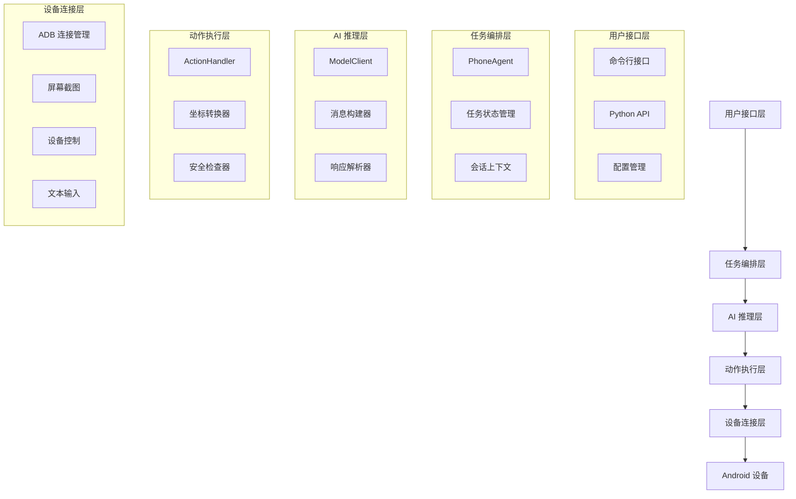

# 设计文档 - Phone Agent 智能手机自动化系统

## 概述

Phone Agent 是一个基于视觉语言模型的智能手机自动化系统，通过 AI 理解屏幕内容并执行自然语言指令来完成各种手机操作任务。系统采用模块化架构，支持多设备连接、多语言环境，并内置安全机制确保用户隐私和数据安全。

核心工作流程：
1. 用户输入自然语言任务描述
2. 系统截取当前屏幕状态
3. 视觉语言模型分析屏幕内容并生成操作指令
4. 动作执行器将指令转换为具体的设备操作
5. 循环执行直到任务完成

## 架构

系统采用分层架构设计，从上到下分为：



### 核心组件

1. **PhoneAgent**: 主控制器，协调各组件完成任务
2. **ModelClient**: AI 模型客户端，处理视觉推理
3. **ActionHandler**: 动作执行器，将 AI 指令转换为设备操作
4. **ADBConnection**: 设备连接管理器，支持 USB 和 WiFi 连接
5. **DeviceController**: 设备操作控制器，执行具体的点击、滑动等操作

## 组件和接口

### PhoneAgent 主控制器

```python
class PhoneAgent:
    def __init__(self, model_config: ModelConfig, agent_config: AgentConfig)
    def run(self, task: str) -> str  # 执行完整任务
    def step(self, task: str = None) -> StepResult  # 执行单步操作
    def reset(self) -> None  # 重置状态
```

**职责**:
- 管理任务执行生命周期
- 协调 AI 推理和动作执行
- 维护会话上下文和状态

### ModelClient AI 推理客户端

```python
class ModelClient:
    def __init__(self, config: ModelConfig)
    def request(self, messages: List[Dict]) -> ModelResponse
    def _parse_response(self, content: str) -> Tuple[str, str]
```

**职责**:
- 与 OpenAI 兼容的 AI 模型通信
- 解析模型响应中的思考过程和动作指令
- 处理多模态输入（文本 + 图像）

### ActionHandler 动作执行器

```python
class ActionHandler:
    def __init__(self, device_id: str, callbacks: Dict)
    def execute(self, action: Dict, width: int, height: int) -> ActionResult
    def _convert_coordinates(self, element: List[int], width: int, height: int) -> Tuple[int, int]
```

**职责**:
- 解析 AI 生成的动作指令
- 转换相对坐标为绝对像素坐标
- 执行具体的设备操作
- 处理敏感操作确认和人工接管

### ADBConnection 连接管理器

```python
class ADBConnection:
    def connect(self, address: str) -> Tuple[bool, str]
    def disconnect(self, address: str = None) -> Tuple[bool, str]
    def list_devices(self) -> List[DeviceInfo]
    def enable_tcpip(self, port: int, device_id: str) -> Tuple[bool, str]
```

**职责**:
- 管理 USB 和 WiFi 设备连接
- 提供设备发现和状态查询
- 支持远程调试模式切换

### DeviceController 设备控制器

```python
# 设备操作接口
def tap(x: int, y: int, device_id: str = None) -> None
def swipe(start_x: int, start_y: int, end_x: int, end_y: int, device_id: str = None) -> None
def type_text(text: str, device_id: str = None) -> None
def launch_app(app_name: str, device_id: str = None) -> bool
```

**职责**:
- 执行基础的设备操作（点击、滑动、输入）
- 管理应用启动和系统导航
- 处理键盘切换和文本输入

## 数据模型

### 核心数据结构

```python
@dataclass
class ModelConfig:
    """AI 模型配置"""
    base_url: str = "http://localhost:8000/v1"
    api_key: str = "EMPTY"
    model_name: str = "autoglm-phone-9b"
    max_tokens: int = 3000
    temperature: float = 0.0

@dataclass
class AgentConfig:
    """Agent 配置"""
    max_steps: int = 100
    device_id: str | None = None
    lang: str = "cn"
    verbose: bool = True

@dataclass
class DeviceInfo:
    """设备信息"""
    device_id: str
    status: str
    connection_type: ConnectionType
    model: str | None = None

@dataclass
class Screenshot:
    """屏幕截图"""
    base64_data: str
    width: int
    height: int
    is_sensitive: bool = False

@dataclass
class ActionResult:
    """动作执行结果"""
    success: bool
    should_finish: bool
    message: str | None = None

@dataclass
class StepResult:
    """单步执行结果"""
    success: bool
    finished: bool
    action: Dict[str, Any] | None
    thinking: str
    message: str | None = None
```

### 动作指令格式

系统支持以下动作类型：

```python
# 应用启动
do(action="Launch", app="微信")

# 点击操作
do(action="Tap", element=[500, 300])

# 敏感点击（需要确认）
do(action="Tap", element=[500, 300], message="支付确认")

# 文本输入
do(action="Type", text="Hello World")

# 滑动操作
do(action="Swipe", start=[100, 500], end=[900, 500])

# 系统操作
do(action="Back")
do(action="Home")

# 特殊操作
do(action="Long Press", element=[500, 300])
do(action="Double Tap", element=[500, 300])
do(action="Wait", duration="2 seconds")

# 人工接管
do(action="Take_over", message="请完成登录验证")

# 任务完成
finish(message="任务已完成")
```

## 正确性属性

*属性是一个特征或行为，应该在系统的所有有效执行中保持为真——本质上是关于系统应该做什么的正式声明。属性作为人类可读规范和机器可验证正确性保证之间的桥梁。*
基于验收标准分析，我识别出以下核心正确性属性：

**属性 1: 任务解析和执行启动**
*对于任何*有效的自然语言任务描述，Phone_Agent 应该能够解析用户意图并开始执行相应的操作序列
**验证: 需求 1.1**

**属性 2: 屏幕状态捕获和分析**
*对于任何*任务执行步骤，Phone_Agent 应该能够截取当前屏幕状态并成功分析界面内容
**验证: 需求 1.2**

**属性 3: 操作指令生成和执行**
*对于任何*屏幕分析结果，Phone_Agent 应该生成有效的操作指令并执行相应动作
**验证: 需求 1.3**

**属性 4: 任务完成状态返回**
*对于任何*完成的任务，Phone_Agent 应该返回正确的完成状态和结果信息
**验证: 需求 1.4**

**属性 5: 错误处理和恢复机制**
*对于任何*执行过程中的错误，Phone_Agent 应该提供详细错误信息并尝试恢复或请求用户干预
**验证: 需求 1.5**

**属性 6: 设备检测和连接管理**
*对于任何*系统启动，ADB_Connection 应该能够检测并正确列出所有已连接的 Android 设备
**验证: 需求 2.1**

**属性 7: 指定设备连接建立**
*对于任何*有效的设备 ID，ADB_Connection 应该能够成功建立与指定设备的连接
**验证: 需求 2.2**

**属性 8: 坐标转换精度**
*对于任何*相对坐标和屏幕尺寸，Device_Controller 应该准确转换为绝对像素坐标并执行精确操作
**验证: 需求 3.1**

**属性 9: 文本输入完整性**
*对于任何*文本输入请求，Device_Controller 应该正确切换键盘并完整输入指定文本内容
**验证: 需求 3.2**

**属性 10: 应用名称到包名映射**
*对于任何*支持的应用名称，App_Package_Manager 应该能够找到对应的正确包名
**验证: 需求 4.1**

**属性 11: 应用启动成功检测**
*对于任何*成功启动的应用，Phone_Agent 应该能够检测并确认当前运行的应用状态
**验证: 需求 4.3**

**属性 12: 敏感操作检测和确认**
*对于任何*敏感操作，Action_Handler 应该暂停执行并正确请求用户确认
**验证: 需求 5.1**

**属性 13: 用户确认响应处理**
*对于任何*用户确认或拒绝响应，Action_Handler 应该根据用户选择正确继续或取消操作
**验证: 需求 5.2, 5.3**

**属性 14: 详细日志输出完整性**
*对于任何*启用详细模式的执行，Phone_Agent 应该输出完整的思考过程、执行动作和结果信息
**验证: 需求 6.1, 6.2**

**属性 15: 多语言模式一致性**
*对于任何*选择的语言模式，Phone_Agent 应该在所有输出中使用一致的对应语言
**验证: 需求 7.1, 7.2, 7.3**

**属性 16: 系统环境检查完整性**
*对于任何*系统启动，Phone_Agent 应该完成所有必要的环境检查并提供准确的状态报告
**验证: 需求 8.1, 8.2, 8.3, 8.4**

## 错误处理

### 错误分类和处理策略

1. **连接错误**
   - ADB 连接失败：重试连接，提供详细错误信息
   - 设备断开：自动重连，超时后提示用户
   - 网络错误：检查网络状态，建议解决方案

2. **模型推理错误**
   - API 调用失败：重试机制，降级处理
   - 响应解析错误：使用默认动作，记录错误日志
   - 超时错误：增加超时时间，提示用户等待

3. **设备操作错误**
   - 坐标越界：自动调整坐标范围
   - 应用未找到：提供应用列表，建议替代方案
   - 权限不足：提示用户授权，提供解决步骤

4. **敏感操作处理**
   - 支付页面：自动暂停，请求人工接管
   - 登录验证：等待用户完成，继续后续操作
   - 隐私信息：跳过敏感内容，保护用户隐私

### 错误恢复机制

```python
class ErrorRecovery:
    def handle_connection_error(self, error: ConnectionError) -> RecoveryAction
    def handle_model_error(self, error: ModelError) -> RecoveryAction
    def handle_device_error(self, error: DeviceError) -> RecoveryAction
    def handle_sensitive_operation(self, context: SensitiveContext) -> RecoveryAction
```

## 测试策略

### 双重测试方法

系统采用单元测试和基于属性的测试相结合的方法：

**单元测试**：
- 验证具体示例和边缘情况
- 测试组件间的集成点
- 确保基础功能的正确性

**基于属性的测试**：
- 验证跨所有输入的通用属性
- 使用 Hypothesis 库进行 Python 属性测试
- 每个属性测试运行最少 100 次迭代
- 每个基于属性的测试必须用注释明确引用设计文档中的正确性属性

**属性测试要求**：
- 使用 Hypothesis 作为 Python 的属性测试库
- 配置每个属性测试运行最少 100 次迭代
- 使用格式标记每个属性测试：'**Feature: phone-agent-automation, Property {number}: {property_text}**'
- 每个正确性属性必须由单个属性测试实现

**测试覆盖范围**：
- 核心功能：任务解析、屏幕分析、动作执行
- 设备管理：连接建立、设备切换、状态监控
- 错误处理：异常捕获、恢复机制、用户通知
- 安全机制：敏感操作检测、用户确认、隐私保护
- 多语言支持：语言切换、内容本地化、一致性检查

### 测试环境配置

```python
# 测试配置示例
TEST_CONFIG = {
    "model_config": {
        "base_url": "http://test-model-server:8000/v1",
        "model_name": "test-autoglm-phone-9b",
        "max_tokens": 1000,
        "temperature": 0.0
    },
    "test_devices": [
        {"device_id": "emulator-5554", "type": "emulator"},
        {"device_id": "test-device-1", "type": "physical"}
    ],
    "mock_responses": {
        "screenshot_service": "mock_screenshot_server",
        "adb_service": "mock_adb_server"
    }
}
```

### 性能测试

- **响应时间**：单步操作 < 3秒，完整任务 < 30秒
- **准确率**：屏幕理解准确率 > 95%，操作执行成功率 > 90%
- **稳定性**：连续运行 1000 次操作无崩溃
- **资源使用**：内存使用 < 500MB，CPU 使用 < 50%

### 集成测试

- **端到端测试**：完整任务流程验证
- **多设备测试**：并发设备操作测试
- **网络测试**：WiFi 连接稳定性测试
- **兼容性测试**：不同 Android 版本适配测试