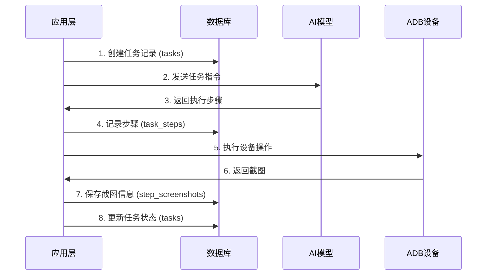

# Open-AutoGLM 数据库设计与说明文档

**文档版本**: v1.0  
**创建日期**: 2024年12月16日  
**数据库类型**: PostgreSQL (Supabase)  
**最后更新**: 2024年12月16日

---

## 1. 数据库架构概述

### 1.1 技术栈

- **数据库**: PostgreSQL 15+ (通过 Supabase 云服务)
- **ORM/客户端**: Supabase Python Client
- **连接池**: Supabase 内置连接池管理
- **备份策略**: Supabase 自动备份 + 应用层数据导出

### 1.2 设计原则

#### 数据一致性
- 使用外键约束确保引用完整性
- 级联删除策略防止孤立数据
- 事务支持保证操作原子性

#### 性能优化
- 合理的索引设计支持高频查询
- JSONB 字段存储灵活的元数据
- 分区策略应对大数据量

#### 可扩展性
- 模块化表设计支持功能扩展
- 版本化迁移脚本支持平滑升级
- 云原生架构支持水平扩展

---

## 2. 核心表结构设计

### 2.1 任务表 (tasks)

**用途**: 存储 AI 自动化任务的基本信息和状态

```sql
CREATE TABLE tasks (
    id UUID DEFAULT gen_random_uuid() PRIMARY KEY,
    task_id TEXT NOT NULL UNIQUE,
    session_id TEXT NOT NULL,
    user_id TEXT NOT NULL,
    task_description TEXT NOT NULL,
    status TEXT NOT NULL,
    created_at TIMESTAMPTZ NOT NULL,
    last_activity TIMESTAMPTZ NOT NULL,
    config JSONB NOT NULL,
    thread_id TEXT,
    error_message TEXT,
    end_time TIMESTAMPTZ,
    result TEXT,
    script_id UUID REFERENCES scripts(id)
);
```

#### 字段说明

| 字段名 | 类型 | 约束 | 说明 |
|--------|------|------|------|
| id | UUID | PRIMARY KEY | 数据库主键，自动生成 |
| task_id | TEXT | NOT NULL, UNIQUE | 业务主键，用于应用层标识 |
| session_id | TEXT | NOT NULL | 会话标识，关联用户会话 |
| user_id | TEXT | NOT NULL | 用户标识 |
| task_description | TEXT | NOT NULL | 任务描述，自然语言 |
| status | TEXT | NOT NULL | 任务状态：running/completed/error/stopped |
| created_at | TIMESTAMPTZ | NOT NULL | 任务创建时间 |
| last_activity | TIMESTAMPTZ | NOT NULL | 最后活动时间 |
| config | JSONB | NOT NULL | 任务配置信息 |
| thread_id | TEXT | NULL | 执行线程标识 |
| error_message | TEXT | NULL | 错误信息 |
| end_time | TIMESTAMPTZ | NULL | 任务结束时间 |
| result | TEXT | NULL | 任务执行结果 |
| script_id | UUID | FOREIGN KEY | 关联的脚本记录 |

#### 索引设计

```sql
CREATE INDEX idx_tasks_task_id ON tasks(task_id);
CREATE INDEX idx_tasks_session_id ON tasks(session_id);
CREATE INDEX idx_tasks_status ON tasks(status);
CREATE INDEX idx_tasks_created_at ON tasks(created_at);
CREATE INDEX idx_tasks_user_id ON tasks(user_id);
CREATE INDEX idx_tasks_script_id ON tasks(script_id);
```

### 2.2 任务步骤表 (task_steps)

**用途**: 存储 AI 执行的详细步骤信息，支持完整的执行轨迹追踪

```sql
CREATE TABLE task_steps (
    id UUID DEFAULT gen_random_uuid() PRIMARY KEY,
    task_id TEXT NOT NULL,
    step_number INTEGER NOT NULL,
    step_type TEXT NOT NULL,
    step_data JSONB NOT NULL,
    thinking TEXT,
    action_result JSONB,
    screenshot_path TEXT,
    duration_ms INTEGER,
    success BOOLEAN DEFAULT true,
    error_message TEXT,
    created_at TIMESTAMPTZ NOT NULL DEFAULT NOW(),
    
    CONSTRAINT fk_task_steps_task_id
        FOREIGN KEY (task_id) REFERENCES tasks(task_id)
        ON DELETE CASCADE
);
```
#### 字段说明

| 字段名 | 类型 | 约束 | 说明 |
|--------|------|------|------|
| id | UUID | PRIMARY KEY | 步骤唯一标识 |
| task_id | TEXT | NOT NULL, FK | 关联的任务ID |
| step_number | INTEGER | NOT NULL | 步骤序号 |
| step_type | TEXT | NOT NULL | 步骤类型：thinking/action/screenshot/error/validation/completion |
| step_data | JSONB | NOT NULL | 步骤详细数据，包含操作参数 |
| thinking | TEXT | NULL | AI 思考过程记录 |
| action_result | JSONB | NULL | 操作执行结果 |
| screenshot_path | TEXT | NULL | 关联截图文件路径 |
| duration_ms | INTEGER | NULL | 步骤执行耗时（毫秒） |
| success | BOOLEAN | DEFAULT true | 步骤执行是否成功 |
| error_message | TEXT | NULL | 错误信息 |
| created_at | TIMESTAMPTZ | NOT NULL | 步骤创建时间 |

#### 索引设计

```sql
CREATE INDEX idx_task_steps_task_id_step_number ON task_steps(task_id, step_number);
CREATE INDEX idx_task_steps_created_at ON task_steps(created_at);
CREATE INDEX idx_task_steps_step_type ON task_steps(step_type);
```

#### 数据示例

```json
{
  "step_data": {
    "action": "Tap",
    "element": [500, 300],
    "message": "点击搜索按钮"
  },
  "thinking": "用户要求搜索美食，当前页面有搜索按钮，需要点击进入搜索界面",
  "action_result": {
    "success": true,
    "message": "点击成功，页面已跳转到搜索界面"
  }
}
```

### 2.3 步骤截图表 (step_screenshots)

**用途**: 管理与任务步骤相关的截图文件信息

```sql
CREATE TABLE step_screenshots (
    id UUID DEFAULT gen_random_uuid() PRIMARY KEY,
    task_id TEXT NOT NULL,
    step_id UUID NOT NULL,
    screenshot_path TEXT NOT NULL,
    file_size INTEGER,
    file_hash TEXT,
    compressed BOOLEAN DEFAULT false,
    metadata JSONB,
    created_at TIMESTAMPTZ NOT NULL DEFAULT NOW(),
    
    CONSTRAINT fk_step_screenshots_task_id
        FOREIGN KEY (task_id) REFERENCES tasks(task_id)
        ON DELETE CASCADE,
    
    CONSTRAINT fk_step_screenshots_step_id
        FOREIGN KEY (step_id) REFERENCES task_steps(id)
        ON DELETE CASCADE,
    
    CONSTRAINT uk_step_screenshots_path_hash
        UNIQUE (screenshot_path, file_hash)
);
```

#### 字段说明

| 字段名 | 类型 | 约束 | 说明 |
|--------|------|------|------|
| id | UUID | PRIMARY KEY | 截图记录唯一标识 |
| task_id | TEXT | NOT NULL, FK | 关联的任务ID |
| step_id | UUID | NOT NULL, FK | 关联的步骤ID |
| screenshot_path | TEXT | NOT NULL | 截图文件路径 |
| file_size | INTEGER | NULL | 文件大小（字节） |
| file_hash | TEXT | NULL | 文件SHA256哈希值 |
| compressed | BOOLEAN | DEFAULT false | 是否已压缩 |
| metadata | JSONB | NULL | 截图元数据 |
| created_at | TIMESTAMPTZ | NOT NULL | 创建时间 |

#### 索引设计

```sql
CREATE INDEX idx_step_screenshots_task_id ON step_screenshots(task_id);
CREATE INDEX idx_step_screenshots_step_id ON step_screenshots(step_id);
CREATE INDEX idx_step_screenshots_file_hash ON step_screenshots(file_hash);
```

### 2.4 脚本表 (scripts)

**用途**: 存储自动化脚本的完整信息，支持脚本录制和重放功能

```sql
CREATE TABLE scripts (
    id UUID DEFAULT gen_random_uuid() PRIMARY KEY,
    task_id TEXT NOT NULL,
    task_name TEXT NOT NULL,
    description TEXT NOT NULL,
    total_steps INTEGER NOT NULL DEFAULT 0,
    success_rate DECIMAL(5,2) DEFAULT 0.00,
    execution_time DECIMAL(10,2) DEFAULT 0.00,
    device_id TEXT,
    model_name TEXT,
    created_at TIMESTAMPTZ NOT NULL DEFAULT NOW(),
    updated_at TIMESTAMPTZ NOT NULL DEFAULT NOW(),
    script_data JSONB NOT NULL,
    script_metadata JSONB NOT NULL,
    script_version TEXT DEFAULT '1.0',
    checksum TEXT,
    is_active BOOLEAN DEFAULT TRUE
);
```

#### 字段说明

| 字段名 | 类型 | 约束 | 说明 |
|--------|------|------|------|
| id | UUID | PRIMARY KEY | 脚本唯一标识 |
| task_id | TEXT | NOT NULL | 关联的任务ID |
| task_name | TEXT | NOT NULL | 脚本名称 |
| description | TEXT | NOT NULL | 脚本描述 |
| total_steps | INTEGER | NOT NULL | 总步骤数 |
| success_rate | DECIMAL(5,2) | DEFAULT 0.00 | 成功率百分比 |
| execution_time | DECIMAL(10,2) | DEFAULT 0.00 | 执行时间（秒） |
| device_id | TEXT | NULL | 设备标识 |
| model_name | TEXT | NULL | AI模型名称 |
| created_at | TIMESTAMPTZ | NOT NULL | 创建时间 |
| updated_at | TIMESTAMPTZ | NOT NULL | 更新时间 |
| script_data | JSONB | NOT NULL | 完整脚本数据 |
| script_metadata | JSONB | NOT NULL | 脚本元数据 |
| script_version | TEXT | DEFAULT '1.0' | 脚本版本 |
| checksum | TEXT | NULL | 数据校验和 |
| is_active | BOOLEAN | DEFAULT TRUE | 是否有效 |

#### 索引设计

```sql
CREATE INDEX idx_scripts_task_id ON scripts(task_id);
CREATE INDEX idx_scripts_created_at ON scripts(created_at);
CREATE INDEX idx_scripts_task_name ON scripts(task_name);
CREATE INDEX idx_scripts_device_id ON scripts(device_id);
CREATE INDEX idx_scripts_model_name ON scripts(model_name);
CREATE INDEX idx_scripts_is_active ON scripts(is_active);
CREATE INDEX idx_scripts_data_gin ON scripts USING GIN (script_data);
CREATE INDEX idx_scripts_metadata_gin ON scripts USING GIN (script_metadata);
```

#### 约束条件

```sql
ALTER TABLE scripts ADD CONSTRAINT check_total_steps_non_negative 
    CHECK (total_steps >= 0);
ALTER TABLE scripts ADD CONSTRAINT check_success_rate_range 
    CHECK (success_rate >= 0 AND success_rate <= 100);
ALTER TABLE scripts ADD CONSTRAINT check_execution_time_non_negative 
    CHECK (execution_time >= 0);
```

---

## 3. 数据库视图设计

### 3.1 脚本摘要视图 (script_summary)

**用途**: 简化常用的脚本查询，提供脚本与任务的关联信息

```sql
CREATE OR REPLACE VIEW script_summary AS
SELECT
    s.id,
    s.task_id,
    s.task_name,
    s.total_steps,
    s.success_rate,
    s.execution_time,
    s.device_id,
    s.model_name,
    s.created_at,
    s.is_active,
    t.status as task_status,
    t.user_id,
    t.session_id
FROM scripts s
LEFT JOIN tasks t ON s.task_id = t.task_id
WHERE s.is_active = TRUE;
```

---

## 4. 数据关系图

```
┌─────────────────┐       ┌─────────────────┐       ┌─────────────────┐
│     tasks       │       │   task_steps    │       │step_screenshots │
├─────────────────┤       ├─────────────────┤       ├─────────────────┤
│ id (PK)         │       │ id (PK)         │       │ id (PK)         │
│ task_id (UK)    │◄──────┤ task_id (FK)    │◄──────┤ task_id (FK)    │
│ session_id      │       │ step_number     │       │ step_id (FK)    │
│ user_id         │       │ step_type       │       │ screenshot_path │
│ task_description│       │ step_data       │       │ file_size       │
│ status          │       │ thinking        │       │ file_hash       │
│ created_at      │       │ action_result   │       │ compressed      │
│ last_activity   │       │ screenshot_path │       │ metadata        │
│ config          │       │ duration_ms     │       │ created_at      │
│ thread_id       │       │ success         │       └─────────────────┘
│ error_message   │       │ error_message   │
│ end_time        │       │ created_at      │
│ result          │       └─────────────────┘
│ script_id (FK)  │
└─────────────────┘
         │
         ▼
┌─────────────────┐
│    scripts      │
├─────────────────┤
│ id (PK)         │
│ task_id         │
│ task_name       │
│ description     │
│ total_steps     │
│ success_rate    │
│ execution_time  │
│ device_id       │
│ model_name      │
│ created_at      │
│ updated_at      │
│ script_data     │
│ script_metadata │
│ script_version  │
│ checksum        │
│ is_active       │
└─────────────────┘
```

---

## 5. 数据流设计

### 5.1 任务执行流程



### 5.2 数据写入策略

#### 实时写入
- **任务状态**: 立即更新到 tasks 表
- **关键步骤**: 重要操作步骤实时写入

#### 批量写入
- **步骤详情**: 缓冲区满时批量写入 task_steps
- **截图信息**: 异步批量处理截图上传

#### 异步处理
- **文件上传**: 截图文件异步上传到云存储
- **数据清理**: 定期清理过期数据

---

## 6. 性能优化策略

### 6.1 查询优化

#### 索引策略
```sql
-- 复合索引支持常用查询模式
CREATE INDEX idx_task_steps_task_id_step_number ON task_steps(task_id, step_number);

-- 时间范围查询优化
CREATE INDEX idx_tasks_created_at_status ON tasks(created_at, status);

-- JSONB 字段 GIN 索引
CREATE INDEX idx_task_steps_data_gin ON task_steps USING GIN (step_data);
```

#### 查询优化示例
```sql
-- 获取任务的最新步骤（使用复合索引）
SELECT * FROM task_steps 
WHERE task_id = $1 
ORDER BY step_number DESC 
LIMIT 10;

-- 按时间范围统计任务（使用复合索引）
SELECT status, COUNT(*) 
FROM tasks 
WHERE created_at >= $1 AND created_at <= $2 
GROUP BY status;
```

### 6.2 数据分区策略

#### 时间分区
```sql
-- 按月分区 task_steps 表（大数据量场景）
CREATE TABLE task_steps_y2024m12 PARTITION OF task_steps
FOR VALUES FROM ('2024-12-01') TO ('2025-01-01');
```

#### 分区优势
- **查询性能**: 减少扫描数据量
- **维护效率**: 独立的分区维护
- **存储优化**: 历史数据压缩存储

### 6.3 缓存策略

#### 应用层缓存
```python
# 任务状态缓存
@lru_cache(maxsize=1000)
def get_task_status(task_id: str) -> str:
    return db.get_task_status(task_id)

# 步骤统计缓存
class StepStatistics:
    def __init__(self):
        self._cache = {}
        self._cache_timeout = 300  # 5分钟
```

#### 数据库层优化
- **连接池**: Supabase 内置连接池管理
- **查询缓存**: PostgreSQL 查询计划缓存
- **物化视图**: 复杂统计查询物化

---

## 7. 数据安全与备份

### 7.1 数据安全

#### 访问控制
```sql
-- 行级安全策略（RLS）
ALTER TABLE tasks ENABLE ROW LEVEL SECURITY;

CREATE POLICY tasks_user_policy ON tasks
FOR ALL USING (user_id = current_user_id());
```

#### 数据加密
- **传输加密**: TLS 1.3 加密传输
- **存储加密**: Supabase 提供静态数据加密
- **敏感字段**: 错误信息等敏感数据脱敏处理

### 7.2 备份策略

#### 自动备份
- **Supabase 自动备份**: 每日全量备份
- **时间点恢复**: 支持任意时间点恢复
- **跨区域复制**: 多区域数据冗余

#### 应用层备份
```python
def export_task_data(task_id: str) -> dict:
    """导出完整任务数据"""
    return {
        'task': get_task(task_id),
        'steps': get_task_steps(task_id),
        'screenshots': get_step_screenshots(task_id),
        'scripts': get_task_scripts(task_id)
    }
```

---

## 8. 数据迁移与版本管理

### 8.1 迁移脚本管理

#### 版本化迁移
```
database/migrations/
├── 001_create_task_steps.sql
├── 002_create_step_screenshots.sql
├── 003_add_scripts_table.sql
└── 004_add_performance_indexes.sql
```

#### 迁移执行流程
```python
class DatabaseMigration:
    def __init__(self):
        self.migrations = self._load_migrations()
    
    def migrate(self):
        """执行待处理的迁移"""
        for migration in self.pending_migrations():
            self._execute_migration(migration)
            self._record_migration(migration)
```

### 8.2 数据兼容性

#### 向后兼容
- **字段添加**: 新字段设置默认值
- **类型变更**: 渐进式类型迁移
- **约束修改**: 分步骤约束调整

#### 版本控制
```sql
-- 数据库版本表
CREATE TABLE schema_migrations (
    version TEXT PRIMARY KEY,
    applied_at TIMESTAMPTZ NOT NULL DEFAULT NOW()
);
```

---

## 9. 监控与维护

### 9.1 性能监控

#### 关键指标
```python
class DatabaseMetrics:
    def get_performance_stats(self):
        return {
            'connection_count': self._get_connection_count(),
            'query_performance': self._get_slow_queries(),
            'table_sizes': self._get_table_sizes(),
            'index_usage': self._get_index_usage()
        }
```

#### 监控查询
```sql
-- 慢查询监控
SELECT query, mean_time, calls 
FROM pg_stat_statements 
WHERE mean_time > 1000 
ORDER BY mean_time DESC;

-- 表大小监控
SELECT 
    schemaname,
    tablename,
    pg_size_pretty(pg_total_relation_size(schemaname||'.'||tablename)) as size
FROM pg_tables 
WHERE schemaname = 'public'
ORDER BY pg_total_relation_size(schemaname||'.'||tablename) DESC;
```

### 9.2 数据清理策略

#### 自动清理
```python
class DataCleanup:
    def cleanup_old_data(self, retention_days: int = 30):
        """清理过期数据"""
        cutoff_date = datetime.now() - timedelta(days=retention_days)
        
        # 清理步骤数据
        self.cleanup_old_steps(cutoff_date)
        
        # 清理截图文件
        self.cleanup_old_screenshots(cutoff_date)
        
        # 清理完成的任务
        self.cleanup_completed_tasks(cutoff_date)
```

#### 归档策略
```sql
-- 数据归档表
CREATE TABLE tasks_archive (LIKE tasks INCLUDING ALL);
CREATE TABLE task_steps_archive (LIKE task_steps INCLUDING ALL);

-- 归档触发器
CREATE OR REPLACE FUNCTION archive_old_tasks()
RETURNS void AS $$
BEGIN
    -- 移动旧数据到归档表
    INSERT INTO tasks_archive 
    SELECT * FROM tasks 
    WHERE created_at < NOW() - INTERVAL '1 year';
    
    -- 删除原表数据
    DELETE FROM tasks 
    WHERE created_at < NOW() - INTERVAL '1 year';
END;
$$ LANGUAGE plpgsql;
```

---

## 10. 故障排除指南

### 10.1 常见问题

#### 连接问题
```python
def diagnose_connection():
    """诊断数据库连接问题"""
    try:
        result = supabase.table('tasks').select('count', count='exact').execute()
        print(f"✅ 连接正常，任务数量: {result.count}")
    except Exception as e:
        print(f"❌ 连接失败: {e}")
```

#### 性能问题
```sql
-- 检查锁等待
SELECT * FROM pg_stat_activity 
WHERE state = 'active' AND wait_event IS NOT NULL;

-- 检查索引使用情况
SELECT schemaname, tablename, indexname, idx_scan, idx_tup_read, idx_tup_fetch
FROM pg_stat_user_indexes 
ORDER BY idx_scan DESC;
```

### 10.2 数据恢复

#### 时间点恢复
```bash
# Supabase 时间点恢复（通过 Dashboard）
# 1. 进入 Supabase Dashboard
# 2. 选择 Database > Backups
# 3. 选择恢复时间点
# 4. 创建新实例或覆盖现有数据
```

#### 数据导入导出
```python
def export_database():
    """导出数据库数据"""
    tables = ['tasks', 'task_steps', 'step_screenshots', 'scripts']
    export_data = {}
    
    for table in tables:
        result = supabase.table(table).select('*').execute()
        export_data[table] = result.data
    
    return export_data

def import_database(data: dict):
    """导入数据库数据"""
    for table, records in data.items():
        if records:
            supabase.table(table).insert(records).execute()
```

---

## 11. 最佳实践建议

### 11.1 开发规范

#### 查询优化
```python
# ✅ 好的做法：使用索引字段查询
def get_user_tasks(user_id: str, limit: int = 20):
    return supabase.table('tasks')\
        .select('*')\
        .eq('user_id', user_id)\
        .order('created_at', desc=True)\
        .limit(limit)\
        .execute()

# ❌ 避免：全表扫描
def get_tasks_by_description(keyword: str):
    # 这会导致全表扫描
    return supabase.table('tasks')\
        .select('*')\
        .ilike('task_description', f'%{keyword}%')\
        .execute()
```

#### 事务处理
```python
def create_task_with_steps(task_data: dict, steps_data: list):
    """原子性创建任务和步骤"""
    try:
        # 创建任务
        task_result = supabase.table('tasks').insert(task_data).execute()
        task_id = task_result.data[0]['task_id']
        
        # 批量创建步骤
        for step in steps_data:
            step['task_id'] = task_id
        
        supabase.table('task_steps').insert(steps_data).execute()
        
        return task_id
    except Exception as e:
        # 错误处理和回滚
        logger.error(f"创建任务失败: {e}")
        raise
```

### 11.2 性能建议

#### 批量操作
```python
# ✅ 批量插入
def save_steps_batch(steps: list):
    if len(steps) > 100:
        # 分批处理大量数据
        for i in range(0, len(steps), 100):
            batch = steps[i:i+100]
            supabase.table('task_steps').insert(batch).execute()
    else:
        supabase.table('task_steps').insert(steps).execute()

# ❌ 避免：逐条插入
def save_steps_one_by_one(steps: list):
    for step in steps:
        supabase.table('task_steps').insert(step).execute()  # 低效
```

#### 数据分页
```python
def get_tasks_paginated(page: int = 1, page_size: int = 20):
    """分页获取任务"""
    offset = (page - 1) * page_size
    
    return supabase.table('tasks')\
        .select('*')\
        .order('created_at', desc=True)\
        .range(offset, offset + page_size - 1)\
        .execute()
```

---

## 12. 总结

### 12.1 设计亮点

#### 技术优势
- **云原生架构**: 基于 Supabase 的现代化数据库服务
- **灵活的数据模型**: JSONB 字段支持复杂的 AI 数据结构
- **完整的审计轨迹**: 详细记录每个 AI 决策和执行步骤
- **高性能设计**: 合理的索引和查询优化策略

#### 业务价值
- **数据驱动**: 完整的执行数据支持 AI 模型优化
- **可观测性**: 全面的监控和分析能力
- **可扩展性**: 模块化设计支持功能快速迭代
- **可靠性**: 多层备份和恢复机制

### 12.2 未来规划

#### 短期优化
- 实现数据分区提升大数据量性能
- 增加更多业务指标的统计视图
- 优化批量操作的性能

#### 长期发展
- 支持多租户数据隔离
- 实现实时数据流处理
- 集成机器学习模型训练数据管道

---

**文档结束**

> 本文档详细描述了 Open-AutoGLM 项目的完整数据库设计，包括表结构、索引策略、性能优化、安全措施等各个方面。数据库设计充分考虑了 AI 自动化场景的特殊需求，为系统的稳定运行和未来扩展提供了坚实的数据基础。