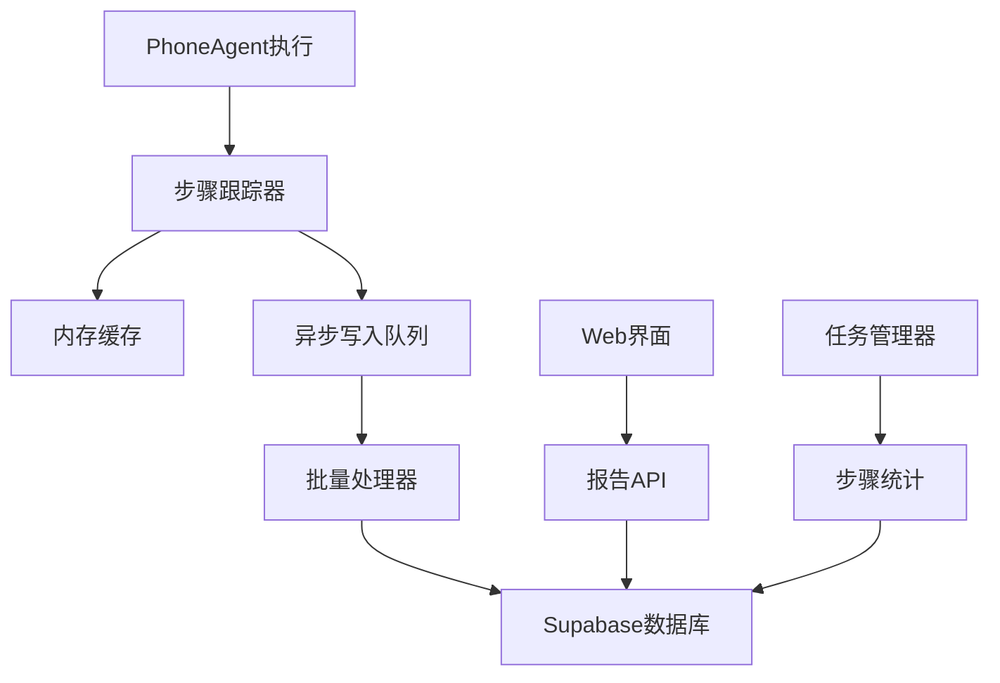

# Design: 任务步骤持久化系统

## 架构概述

### 设计原则
1. **非侵入性** - 步骤持久化不应影响现有的任务执行逻辑
2. **异步处理** - 数据库写入操作应该异步进行，避免阻塞任务执行
3. **容错设计** - 数据持久化失败不应导致任务执行失败
4. **性能优化** - 批量写入和数据压缩以减少I/O开销
5. **可观测性** - 提供清晰的日志和监控指标

### 系统架构



## 数据模型设计

### 核心表结构

#### task_steps 表
```sql
CREATE TABLE task_steps (
    id UUID DEFAULT gen_random_uuid() PRIMARY KEY,
    task_id TEXT NOT NULL,
    step_number INTEGER NOT NULL,
    step_type TEXT NOT NULL, -- 'action', 'thinking', 'screenshot', 'error'
    step_data JSONB NOT NULL,
    thinking TEXT,
    action_result JSONB,
    screenshot_path TEXT,
    duration_ms INTEGER,
    success BOOLEAN DEFAULT true,
    error_message TEXT,
    created_at TIMESTAMPTZ NOT NULL DEFAULT NOW(),
    FOREIGN KEY (task_id) REFERENCES tasks(task_id)
);
```

#### step_screenshots 表
```sql
CREATE TABLE step_screenshots (
    id UUID DEFAULT gen_random_uuid() PRIMARY KEY,
    task_id TEXT NOT NULL,
    step_id UUID NOT NULL,
    screenshot_path TEXT NOT NULL,
    file_size INTEGER,
    file_hash TEXT,
    compressed BOOLEAN DEFAULT false,
    metadata JSONB,
    created_at TIMESTAMPTZ NOT NULL DEFAULT NOW(),
    FOREIGN KEY (task_id) REFERENCES tasks(task_id)
);
```

### 数据关系
- 每个任务有多个步骤（一对多关系）
- 每个步骤可能有多个截图（一对多关系）
- 步骤按执行顺序编号，保证时序性

## 组件设计

### 1. StepTracker 类

```python
@dataclass
class StepTracker:
    """任务步骤跟踪器"""
    task_id: str
    steps: List[StepData] = field(default_factory=list)
    buffer_size: int = 10
    auto_flush: bool = True

    def add_step(self, step_data: StepData) -> None:
        """添加步骤数据"""
        pass

    def flush_to_database(self) -> None:
        """将缓存的数据写入数据库"""
        pass

    async def async_flush(self) -> None:
        """异步写入数据库"""
        pass
```

### 2. StepData 数据结构

```python
@dataclass
class StepData:
    """步骤数据结构"""
    step_number: int
    step_type: str
    thinking: Optional[str] = None
    action: Optional[Dict[str, Any]] = None
    action_result: Optional[Dict[str, Any]] = None
    screenshot_path: Optional[str] = None
    duration_ms: Optional[int] = None
    success: bool = True
    error_message: Optional[str] = None
    timestamp: datetime = field(default_factory=datetime.now)
```

### 3. DatabaseStepWriter 类

```python
class DatabaseStepWriter:
    """数据库步骤写入器"""

    def __init__(self, supabase_client):
        self.supabase = supabase_client
        self.write_queue = asyncio.Queue()
        self.batch_size = 20
        self.batch_timeout = 5.0  # seconds

    async def write_step(self, step_data: StepData) -> None:
        """写入单个步骤"""
        pass

    async def batch_write(self, steps: List[StepData]) -> None:
        """批量写入步骤"""
        pass
```

## 集成方案

### 1. PhoneAgent 集成

```python
class PhoneAgent:
    def __init__(self, ...):
        # 现有初始化代码
        self.step_tracker: Optional[StepTracker] = None

    def run(self, task: str, enable_tracking: bool = True) -> str:
        """运行任务，支持步骤跟踪"""
        if enable_tracking:
            self.step_tracker = StepTracker(
                task_id=self._generate_task_id(),
                auto_flush=True
            )

        # 现有执行逻辑
        # 在每个关键步骤添加跟踪调用

    def _execute_step(self, ...):
        """执行单个步骤，添加跟踪"""
        step_start = time.time()

        try:
            # 现有步骤执行逻辑
            result = self._perform_action(...)

            # 记录成功步骤
            if self.step_tracker:
                step_data = StepData(
                    step_number=self._step_count,
                    step_type='action',
                    thinking=self._current_thinking,
                    action=result.action,
                    action_result=result,
                    duration_ms=int((time.time() - step_start) * 1000)
                )
                self.step_tracker.add_step(step_data)

        except Exception as e:
            # 记录失败步骤
            if self.step_tracker:
                step_data = StepData(
                    step_number=self._step_count,
                    step_type='error',
                    thinking=self._current_thinking,
                    error_message=str(e),
                    success=False
                )
                self.step_tracker.add_step(step_data)
```

### 2. Web API 扩展

```python
# 新增API端点
@app.route('/api/tasks/<task_id>/steps', methods=['GET'])
def get_task_steps(task_id: str):
    """获取任务的所有步骤"""
    pass

@app.route('/api/tasks/<task_id>/report', methods=['GET'])
def get_task_report(task_id: str):
    """获取任务执行报告"""
    pass

@app.route('/api/steps/<step_id>/screenshot', methods=['GET'])
def get_step_screenshot(step_id: str):
    """获取步骤截图"""
    pass
```

## 性能优化策略

### 1. 批量写入
- 使用内存缓冲区收集多个步骤
- 定时批量写入数据库（默认5秒或20条记录）
- 任务完成时强制写入所有缓存数据

### 2. 数据压缩
- 截图文件使用WebP格式压缩
- 大文本数据使用gzip压缩
- JSON数据使用紧凑格式存储

### 3. 索引优化
```sql
-- 性能关键索引
CREATE INDEX idx_task_steps_task_id_step_number ON task_steps(task_id, step_number);
CREATE INDEX idx_task_steps_created_at ON task_steps(created_at);
CREATE INDEX idx_step_screenshots_task_id ON step_screenshots(task_id);
```

### 4. 异步处理
- 所有数据库写入操作使用异步I/O
- 不阻塞主任务执行线程
- 提供写入队列状态监控

## 容错设计

### 1. 降级策略
- 数据库连接失败时，步骤数据暂存内存
- 任务完成后尝试重新连接写入
- 最终失败时记录日志但不影响任务结果

### 2. 数据一致性
- 使用事务确保步骤数据的原子性
- 提供数据校验和修复机制
- 定期清理孤儿数据

### 3. 监控和告警
- 步骤写入成功率监控
- 数据库连接状态监控
- 队列积压告警机制

## 可扩展性考虑

### 1. 存储扩展
- 支持截图数据的CDN分发
- 大量历史数据的归档机制
- 分表策略（按时间或任务ID分表）

### 2. 功能扩展
- 步骤数据的导出功能
- 步骤模式分析和学习
- 性能分析和优化建议

## 安全考虑

### 1. 数据隐私
- 敏感截图数据的加密存储
- 用户数据访问权限控制
- 数据保留策略和自动清理

### 2. 访问控制
- 步骤数据只能被任务创建者访问
- API接口的认证和授权
- 审计日志记录

## 实施计划

### 阶段1：基础架构
- 创建数据库表结构
- 实现StepTracker基础类
- 集成到PhoneAgent执行流程

### 阶段2：数据写入优化
- 实现异步批量写入
- 添加性能监控和错误处理
- 实现容错和降级机制

### 阶段3：API和界面
- 实现步骤查询API
- 创建执行报告页面
- 添加截图回放功能

### 阶段4：优化和扩展
- 性能调优和压力测试
- 添加高级分析功能
- 完善监控和告警