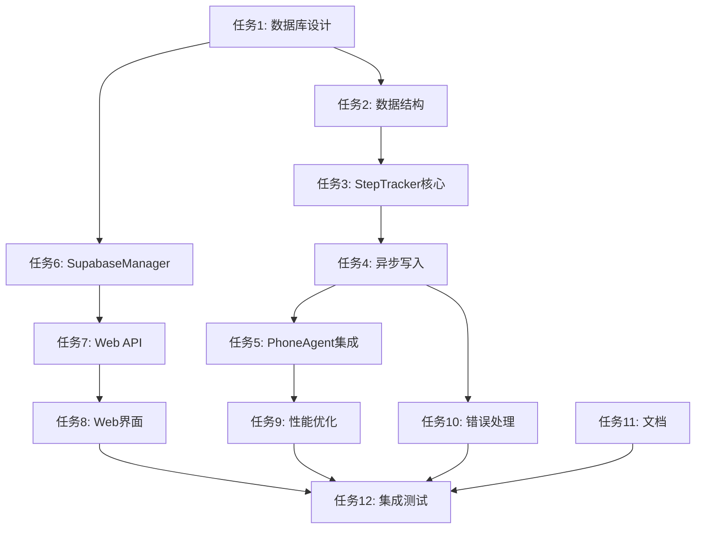

# Tasks: 任务步骤持久化系统

## 1. 数据库设计和创建
**预估时间**: 60分钟
**依赖**: 无

### 子任务
- [ ] 1.1 设计task_steps表结构
- [ ] 1.2 设计step_screenshots表结构
- [ ] 1.3 创建数据库表创建脚本
- [ ] 1.4 创建必要的数据库索引
- [ ] 1.5 更新现有tasks表结构（添加步骤统计字段）
- [ ] 1.6 测试数据库表创建和基本操作

**验收标准**:
- ✅ 所有数据库表创建成功
- ✅ 索引创建正确，查询性能良好
- ✅ 外键约束正确设置
- ✅ 数据库脚本可重复执行

## 2. 核心数据结构定义
**预估时间**: 40分钟
**依赖**: 任务1

### 子任务
- [ ] 2.1 定义StepData数据类
- [ ] 2.2 定义StepTracker类的基础结构
- [ ] 2.3 实现步骤数据的序列化和反序列化
- [ ] 2.4 添加数据验证和类型检查
- [ ] 2.5 实现步骤数据的内存缓存机制

**验收标准**:
- ✅ 数据结构定义完整且类型安全
- ✅ 序列化/反序列化功能正常
- ✅ 数据验证机制完善
- ✅ 内存缓存性能良好

## 3. StepTracker核心功能实现
**预估时间**: 90分钟
**依赖**: 任务2

### 子任务
- [ ] 3.1 实现步骤数据收集功能
- [ ] 3.2 实现内存缓冲区管理
- [ ] 3.3 实现同步数据库写入功能
- [ ] 3.4 实现批量写入优化
- [ ] 3.5 添加缓冲区满自动刷新机制
- [ ] 3.6 实现步骤数据完整性检查

**验收标准**:
- ✅ 步骤数据收集准确无误
- ✅ 内存使用合理，无内存泄漏
- ✅ 批量写入性能良好
- ✅ 数据完整性验证通过

## 4. 异步写入机制实现
**预估时间**: 80分钟
**依赖**: 任务3

### 子任务
- [ ] 4.1 设计异步写入队列
- [ ] 4.2 实现DatabaseStepWriter类
- [ ] 4.3 实现批量异步写入逻辑
- [ ] 4.4 添加写入超时和重试机制
- [ ] 4.5 实现写入状态监控
- [ ] 4.6 优化写入队列的内存管理

**验收标准**:
- ✅ 异步写入不阻塞主线程
- ✅ 批量写入效率高
- ✅ 错误重试机制可靠
- ✅ 监控指标准确

## 5. PhoneAgent集成
**预估时间**: 70分钟
**依赖**: 任务4

### 子任务
- [ ] 5.1 在PhoneAgent中添加StepTracker实例
- [ ] 5.2 修改_execute_step方法添加步骤跟踪
- [ ] 5.3 在关键执行点添加步骤记录
- [ ] 5.4 实现截图信息的自动收集
- [ ] 5.5 添加步骤跟踪的开关控制
- [ ] 5.6 实现任务完成时的数据刷新

**验收标准**:
- ✅ 步骤跟踪不影响原有功能
- ✅ 所有关键执行步骤都被记录
- ✅ 截图信息完整收集
- ✅ 可通过配置控制是否启用跟踪

## 6. SupabaseManager扩展
**预估时间**: 60分钟
**依赖**: 任务1

### 子任务
- [ ] 6.1 添加步骤数据写入方法
- [ ] 6.2 添加步骤数据查询方法
- [ ] 6.3 实现批量步骤写入优化
- [ ] 6.4 添加步骤统计数据更新
- [ ] 6.5 实现截图文件路径管理
- [ ] 6.6 添加数据清理和维护方法

**验收标准**:
- ✅ 步骤数据CRUD操作完整
- ✅ 批量操作性能良好
- ✅ 统计数据准确更新
- ✅ 文件路径管理正确

## 7. Web API接口实现
**预估时间**: 50分钟
**依赖**: 任务6

### 子任务
- [ ] 7.1 实现任务步骤查询API (/api/tasks/<id>/steps)
- [ ] 7.2 实现执行报告生成API (/api/tasks/<id>/report)
- [ ] 7.3 实现步骤截图访问API (/api/steps/<id>/screenshot)
- [ ] 7.4 添加API参数验证和错误处理
- [ ] 7.5 实现数据分页和排序功能
- [ ] 7.6 添加API访问权限控制

**验收标准**:
- ✅ 所有API接口功能正常
- ✅ 错误处理完善
- ✅ 分页排序功能正确
- ✅ 权限控制有效

## 8. Web界面开发
**预估时间**: 80分钟
**依赖**: 任务7

### 子任务
- [ ] 8.1 创建任务执行报告页面模板
- [ ] 8.2 实现步骤列表展示组件
- [ ] 8.3 实现步骤详情查看功能
- [ ] 8.4 添加截图预览和放大功能
- [ ] 8.5 实现步骤时间线可视化
- [ ] 8.6 添加报告导出功能

**验收标准**:
- ✅ 界面美观易用
- ✅ 步骤信息展示清晰
- ✅ 截图预览功能正常
- ✅ 时间线可视化准确

## 9. 性能优化和测试
**预估时间**: 60分钟
**依赖**: 任务5、8

### 子任务
- [ ] 9.1 进行性能压力测试
- [ ] 9.2 优化数据库查询性能
- [ ] 9.3 优化截图加载性能
- [ ] 9.4 测试大规模数据的处理能力
- [ ] 9.5 优化内存使用和垃圾回收
- [ ] 9.6 实现数据压缩和存储优化

**验收标准**:
- ✅ 系统性能满足要求
- ✅ 内存使用稳定
- ✅ 大数据量处理正常
- ✅ 响应时间在可接受范围内

## 10. 错误处理和容错
**预估时间**: 50分钟
**依赖**: 任务4、6

### 子任务
- [ ] 10.1 实现数据库连接失败的降级策略
- [ ] 10.2 添加网络异常处理机制
- [ ] 10.3 实现数据一致性检查和修复
- [ ] 10.4 添加详细的错误日志记录
- [ ] 10.5 实现自动恢复和重试机制
- [ ] 10.6 添加监控和告警功能

**验收标准**:
- ✅ 各种异常情况都能正确处理
- ✅ 系统具备自我恢复能力
- ✅ 错误日志信息详细准确
- ✅ 监控告警及时有效

## 11. 文档和部署
**预估时间**: 40分钟
**依赖**: 所有前置任务

### 子任务
- [ ] 11.1 编写API接口文档
- [ ] 11.2 创建数据库设计文档
- [ ] 11.3 编写部署和配置指南
- [ ] 11.4 创建用户使用手册
- [ ] 11.5 准备测试数据和示例
- [ ] 11.6 编写故障排除指南

**验收标准**:
- ✅ 文档内容完整准确
- ✅ 部署指南清晰易懂
- ✅ 示例数据有助于理解
- ✅ 故障排除指南实用

## 12. 集成测试和验收
**预估时间**: 60分钟
**依赖**: 所有前置任务

### 子任务
- [ ] 12.1 进行端到端集成测试
- [ ] 12.2 验证完整任务执行流程
- [ ] 12.3 测试各种异常场景
- [ ] 12.4 验证数据一致性和完整性
- [ ] 12.5 进行用户体验测试
- [ ] 12.6 完成最终验收和交付

**验收标准**:
- ✅ 所有功能正常工作
- ✅ 异常场景处理正确
- ✅ 数据完整一致
- ✅ 用户体验良好

## 总时间预估

- **核心功能开发**: 450分钟 (约7.5小时)
- **性能优化**: 60分钟 (约1小时)
- **错误处理**: 50分钟 (约0.8小时)
- **文档编写**: 40分钟 (约0.7小时)
- **测试验收**: 60分钟 (约1小时)

**总计**: 660分钟 (约11小时)

## 任务依赖关系

## 关键风险和缓解措施

1. **性能风险** - 步骤跟踪可能影响任务执行性能
   - 缓解措施：异步写入、批量处理、性能监控

2. **数据一致性** - 数据库写入失败可能导致数据丢失
   - 缓解措施：事务处理、重试机制、本地缓存

3. **存储空间** - 大量步骤和截图数据可能消耗大量存储
   - 缓解措施：数据压缩、定期清理、分层存储

4. **复杂性风险** - 系统复杂度增加可能影响稳定性
   - 缓解措施：模块化设计、充分测试、降级机制