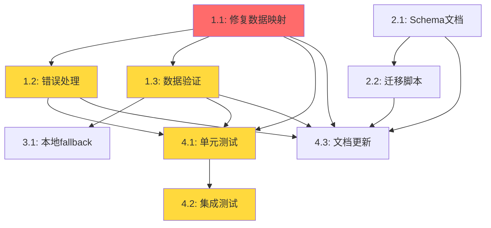

# 修复任务持久化问题 - 任务清单

## 概述
本变更旨在修复任务从Supabase数据库加载时的数据映射问题,提升系统稳定性和数据一致性。

## 任务列表

### 阶段1: 核心修复 (高优先级)

#### 任务1.1: 修复GlobalTask数据映射逻辑
**优先级**: 🔴 紧急
**预估时间**: 1小时
**负责模块**: `web/supabase_manager.py`

- [ ] 修改`GlobalTask.from_dict()`方法,添加字段过滤逻辑
- [ ] 创建允许字段的白名单(基于dataclass字段)
- [ ] 过滤数据库内部字段(`id`, `updated_at`等)
- [ ] 添加字段类型验证和安全转换
- [ ] 处理可选字段的None值情况

**验证标准**:
- `GlobalTask.from_dict()`能正确处理包含额外字段的字典
- 不抛出"unexpected keyword argument"异常
- 所有dataclass字段正确赋值

**依赖**: 无

---

#### 任务1.2: 增强错误处理和日志记录
**优先级**: 🟡 高
**预估时间**: 0.5小时
**负责模块**: `web/supabase_manager.py`

- [ ] 在`load_tasks()`方法中添加详细的异常捕获
- [ ] 记录每个加载失败的任务的详细信息
- [ ] 加载失败时跳过有问题的任务,继续加载其他任务
- [ ] 在控制台输出清晰的错误诊断信息
- [ ] 添加数据验证失败时的警告日志

**验证标准**:
- 单个任务数据损坏不影响其他任务加载
- 错误日志包含足够的调试信息
- 应用能正常启动即使有部分任务加载失败

**依赖**: 任务1.1

---

#### 任务1.3: 添加数据完整性验证
**优先级**: 🟡 高
**预估时间**: 1小时
**负责模块**: `web/supabase_manager.py`

- [ ] 创建`_validate_task_data()`方法验证任务数据
- [ ] 检查必需字段是否存在
- [ ] 验证字段类型是否正确
- [ ] 验证datetime字段格式
- [ ] 验证status字段的枚举值
- [ ] 添加数据修复逻辑(例如:缺失的可选字段设置默认值)

**验证标准**:
- 所有从数据库加载的任务数据通过验证
- 不合法的数据被正确识别和处理
- 能自动修复常见的数据问题

**依赖**: 任务1.1

---

### 阶段2: 数据库Schema优化 (中优先级)

#### 任务2.1: 更新数据库Schema文档
**优先级**: 🟢 中
**预估时间**: 0.5小时
**负责模块**: `database/create_supabase_tables.py`

- [ ] 更新tasks表的CREATE TABLE语句
- [ ] 添加`updated_at`字段(自动更新时间戳)
- [ ] 修改`script_id`字段类型为UUID
- [ ] 添加外键约束: `script_id REFERENCES scripts(id)`
- [ ] 添加CHECK约束验证status字段
- [ ] 更新索引定义

**验证标准**:
- Schema文档准确反映数据库实际结构
- 提供完整的DDL语句用于新环境部署

**依赖**: 无

---

#### 任务2.2: 创建数据库迁移脚本
**优先级**: 🟢 中
**预估时间**: 1小时
**负责模块**: `database/migrations/`

- [ ] 创建迁移脚本添加`updated_at`字段
- [ ] 创建迁移脚本添加CHECK约束
- [ ] 创建迁移脚本修改`script_id`类型
- [ ] 添加迁移回滚脚本
- [ ] 编写迁移文档和执行指南

**验证标准**:
- 迁移脚本能成功执行无错误
- 现有数据保持完整
- 能安全回滚所有迁移

**依赖**: 任务2.1

---

### 阶段3: 降级策略和容错 (低优先级)

#### 任务3.1: 实现本地存储fallback
**优先级**: ⚪ 低
**预估时间**: 2小时
**负责模块**: `web/supabase_manager.py`, `web/task_storage.py`

- [ ] 创建`LocalTaskStorage`类处理pickle文件存储
- [ ] 在`SupabaseTaskManager`中集成fallback逻辑
- [ ] Supabase连接失败时自动切换到本地存储
- [ ] 实现本地存储和Supabase的数据同步
- [ ] 添加配置选项选择存储后端

**验证标准**:
- Supabase不可用时应用能正常启动和运行
- 数据在本地和云端保持一致
- 用户无感知地切换存储后端

**依赖**: 任务1.3

---

#### 任务3.2: 添加健康检查端点
**优先级**: ⚪ 低
**预估时间**: 0.5小时
**负责模块**: `web/app.py`

- [ ] 创建`/api/health`端点
- [ ] 检查Supabase连接状态
- [ ] 检查任务存储状态
- [ ] 返回详细的健康状态信息
- [ ] 添加Prometheus metrics支持(可选)

**验证标准**:
- 健康检查端点返回准确的系统状态
- 可用于监控和告警

**依赖**: 无

---

### 阶段4: 测试和文档 (高优先级)

#### 任务4.1: 编写单元测试
**优先级**: 🟡 高
**预估时间**: 1.5小时
**负责模块**: `tests/test_supabase_manager.py`

- [ ] 测试`GlobalTask.from_dict()`的各种场景
- [ ] 测试字段过滤逻辑
- [ ] 测试数据验证逻辑
- [ ] 测试错误处理路径
- [ ] 测试datetime转换逻辑
- [ ] 测试缺失字段和额外字段的处理

**验证标准**:
- 测试覆盖率达到85%以上
- 所有边界情况都有测试覆盖
- 测试可重复运行

**依赖**: 任务1.1, 1.2, 1.3

---

#### 任务4.2: 集成测试
**优先级**: 🟡 高
**预估时间**: 1小时
**负责模块**: `tests/test_integration.py`

- [ ] 测试完整的任务创建-保存-加载流程
- [ ] 测试Supabase连接失败场景
- [ ] 测试数据迁移流程
- [ ] 测试并发任务操作
- [ ] 测试大量任务的加载性能

**验证标准**:
- 端到端流程正常工作
- 所有错误场景都能正确处理
- 性能满足要求(加载1000个任务<2秒)

**依赖**: 任务1.1, 1.2, 1.3, 4.1

---

#### 任务4.3: 更新文档
**优先级**: 🟢 中
**预估时间**: 0.5小时
**负责模块**: `docs/`

- [ ] 更新架构文档说明数据持久化机制
- [ ] 记录常见问题和解决方案
- [ ] 更新数据库Schema文档
- [ ] 添加故障排查指南
- [ ] 更新部署文档(数据库迁移步骤)

**验证标准**:
- 文档准确、清晰、完整
- 包含实际使用示例
- 新用户能通过文档完成部署

**依赖**: 任务1.1, 1.2, 1.3, 2.1, 2.2

---

## 任务依赖关系图

## 里程碑

### M1: 核心修复完成 (关键路径)
- 完成时间: Day 1-2
- 包含任务: 1.1, 1.2, 1.3
- 交付物: 应用能正常启动并加载任务历史

### M2: 测试验证完成
- 完成时间: Day 2-3
- 包含任务: 4.1, 4.2
- 交付物: 所有测试通过,质量达标

### M3: 完整发布就绪
- 完成时间: Day 3-4
- 包含任务: 2.1, 2.2, 4.3
- 交付物: 文档完整,可以部署到生产环境

## 风险评估

### 高风险
- **数据迁移失败**: 可能导致历史数据丢失
  - 缓解措施: 迁移前完整备份,提供回滚脚本

### 中风险
- **性能回退**: 数据验证可能影响加载速度
  - 缓解措施: 性能测试,优化验证逻辑

### 低风险
- **兼容性问题**: 新旧数据格式冲突
  - 缓解措施: 渐进式部署,充分测试

## 验收标准

1. ✅ 应用启动无错误,能加载所有历史任务
2. ✅ 新任务正确保存和加载
3. ✅ 单元测试覆盖率>85%,所有测试通过
4. ✅ 集成测试验证端到端流程正常
5. ✅ 文档完整且准确
6. ✅ 代码审查通过
7. ✅ 数据迁移脚本经过验证

## 工作量估算

| 阶段 | 任务数 | 预估时间 | 优先级分布 |
|------|-------|---------|-----------|
| 阶段1 | 3 | 2.5小时 | 高 |
| 阶段2 | 2 | 1.5小时 | 中 |
| 阶段3 | 2 | 2.5小时 | 低 |
| 阶段4 | 3 | 3小时 | 高-中 |
| **总计** | **10** | **9.5小时** | - |

## 建议执行顺序

**紧急修复路径** (最小可行产品):
1. 任务1.1 → 1.2 → 1.3 (核心修复) - 2.5小时
2. 任务4.1 (基础测试) - 0.5小时
3. **总计**: 3小时即可解决当前的启动失败问题

**完整实施路径**:
1. 阶段1全部 (2.5小时)
2. 阶段4测试 (2.5小时)
3. 阶段2Schema (1.5小时)
4. 阶段4文档 (0.5小时)
5. 阶段3容错(可选) (2.5小时)
