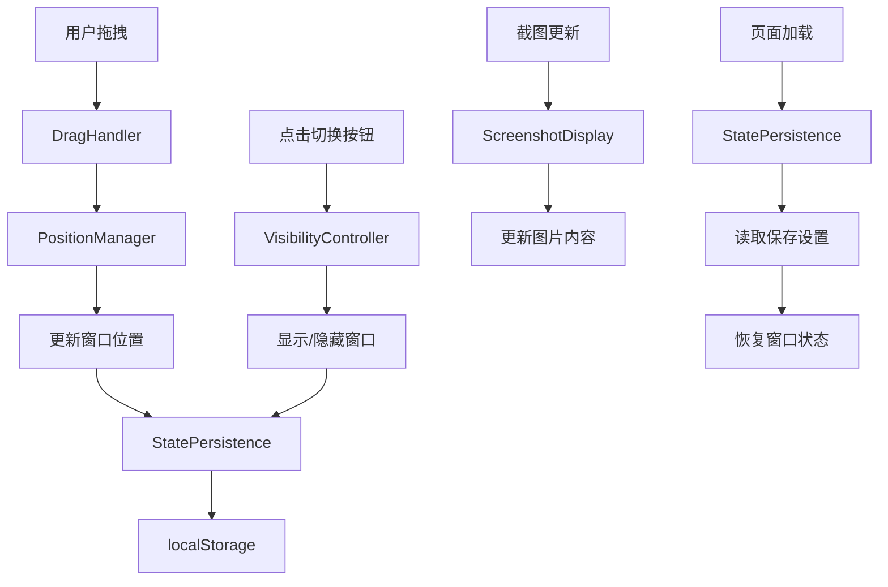

# Design: 悬浮截图窗口交互设计

## 架构设计

### 组件结构

```
Floating Screenshot System
├── FloatingScreenshotManager (核心管理器)
│   ├── DragHandler (拖拽处理)
│   ├── PositionManager (位置管理)
│   ├── VisibilityController (显示控制)
│   └── StatePersistence (状态持久化)
├── FloatingWindow (悬浮窗口组件)
│   ├── ScreenshotDisplay (截图显示)
│   ├── WindowControls (窗口控制)
│   └── DragHandle (拖拽手柄)
└── ToggleButton (切换按钮组件)
```

### 数据流设计



### 技术架构

**事件系统设计**:
```javascript
// 自定义事件系统
class FloatingScreenshotEvents {
    static DRAG_START = 'floating-screenshot:drag-start'
    static DRAG_END = 'floating-screenshot:drag-end'
    POSITION_CHANGE = 'floating-screenshot:position-change'
    VISIBILITY_TOGGLE = 'floating-screenshot:visibility-toggle'
}
```

**配置系统设计**:
```javascript
// 用户配置接口
interface FloatingScreenshotConfig {
    mode: 'floating' | 'panel'           // 显示模式
    position: { x: number, y: number }   // 窗口位置
    size: { width: number, height: number } // 窗口大小
    opacity: number                      // 透明度
    autoHide: boolean                    // 自动隐藏
    autoHideDelay: number                // 自动隐藏延迟
    lockPosition: boolean                // 锁定位置
}
```

## 交互设计

### 拖拽交互

**拖拽启动**:
- 鼠标悬停在悬浮窗口上时显示拖拽光标
- 窗口顶部显示明显的拖拽区域
- 支持触摸设备的长按拖拽

**拖拽过程**:
- 实时跟随鼠标/手指移动
- 显示半透明的拖拽预览
- 边界检测和自动吸附

**拖拽结束**:
- 平滑动画到最终位置
- 自动吸附到屏幕边缘(可选)
- 位置立即保存到localStorage

### 窗口控制

**显示/隐藏**:
- 设置按钮旁的切换按钮
- 点击切换显示/隐藏状态
- 带有过渡动画的渐变效果

**窗口调整**:
- 支持鼠标滚轮缩放(按住Ctrl)
- 双击标题栏最大化/还原
- 右键菜单提供更多选项

### 智能定位

**初始位置**:
- 默认定位在对话框右上角
- 距离右边缘20px,顶部10px
- 避免遮挡输入框和控制按钮

**位置记忆**:
- 记住用户最后拖拽的位置
- 页面刷新后自动恢复
- 不同屏幕尺寸自适应调整

**碰撞检测**:
- 防止窗口拖出视口边界
- 智能的边缘吸附效果
- 与其他UI元素的避让

## 视觉设计

### 悬浮窗口样式

**外观设计**:
```css
.floating-screenshot {
    position: fixed;
    background: white;
    border-radius: 12px;
    box-shadow: 0 8px 32px rgba(0, 0, 0, 0.15);
    border: 1px solid rgba(0, 0, 0, 0.1);
    backdrop-filter: blur(10px);
    z-index: 1000;
    transition: transform 0.2s ease;
}

.floating-screenshot:hover {
    transform: translateY(-2px);
    box-shadow: 0 12px 48px rgba(0, 0, 0, 0.2);
}
```

**拖拽状态**:
```css
.floating-screenshot.dragging {
    cursor: grabbing;
    opacity: 0.8;
    transform: scale(1.02);
    transition: none;
}
```

**隐藏状态**:
```css
.floating-screenshot.hidden {
    opacity: 0;
    transform: scale(0.9);
    pointer-events: none;
}
```

### 切换按钮设计

**按钮样式**:
- 圆形按钮,与设置按钮风格一致
- 使用眼睛图标表示显示/隐藏
- 状态变化时有明确的视觉反馈

**状态指示**:
- 显示状态: 实心眼睛图标
- 隐藏状态: 空心眼睛图标
- 悬停效果: 轻微放大和颜色变化

### 响应式设计

**桌面端 (>1024px)**:
- 悬浮窗口最大尺寸: 300x400px
- 完整的拖拽和调整功能
- 丰富的交互效果

**平板端 (768px-1024px)**:
- 悬浮窗口最大尺寸: 250x350px
- 简化的拖拽体验
- 支持触摸手势

**移动端 (<768px)**:
- 悬浮窗口最大尺寸: 200x300px
- 更大的拖拽触摸区域
- 提供最小化选项

## 性能优化

### 渲染优化

**CSS优化**:
```css
.floating-screenshot {
    will-change: transform;
    contain: layout style paint;
}
```

**JavaScript优化**:
- 使用requestAnimationFrame优化拖拽性能
- 防抖处理频繁的位置更新
- 智能的截图更新策略

### 内存管理

**事件监听管理**:
- 页面卸载时清理所有事件监听器
- 使用WeakMap避免内存泄漏
- 及时销毁不用的DOM引用

**资源清理**:
- 大截图的及时回收
- Canvas对象的正确释放
- Blob URL的手动撤销

## 可访问性设计

### 键盘导航

**焦点管理**:
- Tab键可以导航到悬浮窗口
- 焦点在窗口内循环导航
- ESC键关闭悬浮窗口

**快捷键支持**:
- Ctrl+S: 切换显示/隐藏
- Ctrl+R: 重置位置
- Ctrl+L: 锁定/解锁位置

### 屏幕阅读器

**语义化标记**:
```html
<div
    class="floating-screenshot"
    role="dialog"
    aria-label="实时截图窗口"
    aria-describedby="screenshot-description"
    tabindex="-1"
>
    <div id="screenshot-description" class="sr-only">
        显示手机操作的实时截图,支持拖拽调整位置
    </div>
</div>
```

**状态通知**:
- 窗口显示/隐藏时的ARIA实时区域更新
- 拖拽位置变化的语音反馈
- 截图更新时的内容描述

### 高对比度模式

**颜色适配**:
- 使用系统颜色变量
- 提供高对比度专用样式
- 确保足够的颜色对比度

## 兼容性设计

### 浏览器兼容

**现代浏览器**:
- Chrome 80+
- Firefox 75+
- Safari 13+
- Edge 80+

**功能检测**:
```javascript
const supportsDrag = 'draggable' in document.createElement('div');
const supportsTouch = 'ontouchstart' in window;
const supportsLocalStorage = () => {
    try {
        localStorage.setItem('test', 'test');
        localStorage.removeItem('test');
        return true;
    } catch {
        return false;
    }
};
```

### 降级方案

**不支持拖拽的浏览器**:
- 提供定位按钮移动窗口
- 使用箭头键调整位置
- 固定在预设位置选项

**不支持localStorage的浏览器**:
- 使用sessionStorage作为备选
- 使用URL参数传递简单设置
- 提供Cookie存储选项

## 测试策略

### 单元测试

**组件测试**:
- DragHandler的事件处理逻辑
- PositionManager的位置计算
- VisibilityController的状态管理
- StatePersistence的数据读写

**工具函数测试**:
- 边界检测算法
- 位置计算函数
- 配置验证逻辑

### 集成测试

**交互流程测试**:
- 完整的拖拽操作流程
- 显示/隐藏切换功能
- 页面刷新后状态恢复
- 多设备兼容性测试

**性能测试**:
- 拖拽流畅度测试
- 内存泄漏检测
- 截图更新性能测试

### 用户测试

**可用性测试**:
- 新用户的首次使用体验
- 拖拽操作的直观性
- 功能发现的容易程度

**无障碍测试**:
- 屏幕阅读器兼容性
- 键盘导航完整性
- 高对比度模式效果