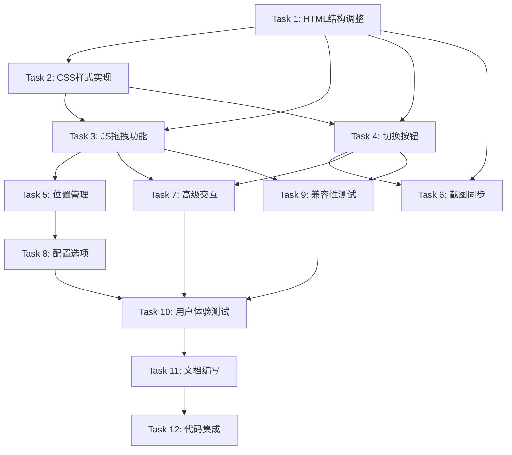

# Tasks: 前端交互优化 - 实时截图悬浮窗口功能

## 核心实现任务

### Task 1: HTML结构调整和基础组件创建
**预估时间**: 45分钟
**依赖**: 无

**子任务**:
- [ ] 在聊天区域添加悬浮截图容器结构
- [ ] 在设置按钮旁添加截图切换按钮
- [ ] 创建悬浮窗口的基本HTML结构
- [ ] 添加必要的ARIA标签和无障碍支持
- [ ] 验证HTML结构在不同浏览器中的兼容性

**验收标准**:
- ✅ 悬浮截图容器正确定位在DOM中
- ✅ 切换按钮添加到聊天头部控制区域
- ✅ 语义化HTML符合无障碍标准
- ✅ 结构与现有界面协调一致

### Task 2: CSS样式实现和悬浮效果
**预估时间**: 60分钟
**依赖**: Task 1

**子任务**:
- [ ] 实现悬浮窗口的基础样式(定位、阴影、圆角等)
- [ ] 添加拖拽时的视觉状态样式
- [ ] 实现显示/隐藏的过渡动画效果
- [ ] 设计切换按钮的样式和状态变化
- [ ] 添加响应式断点和移动端适配
- [ ] 优化CSS性能(transform、will-change等)

**验收标准**:
- ✅ 悬浮窗口视觉效果符合设计规范
- ✅ 拖拽和状态变化有流畅的动画
- ✅ 在不同屏幕尺寸下显示正常
- ✅ CSS性能优化到位,无明显卡顿

### Task 3: JavaScript拖拽功能实现
**预估时间**: 90分钟
**依赖**: Task 1, Task 2

**子任务**:
- [ ] 实现基础的鼠标拖拽功能
- [ ] 添加触摸设备支持
- [ ] 实现边界检测和限制
- [ ] 添加拖拽过程中的视觉反馈
- [ ] 实现平滑的拖拽性能优化
- [ ] 处理拖拽冲突和边界情况

**验收标准**:
- ✅ 鼠标拖拽流畅自然
- ✅ 触摸设备拖拽正常工作
- ✅ 窗口不会被拖出视口
- ✅ 拖拽性能良好,无延迟

### Task 4: 切换按钮和显示控制
**预估时间**: 40分钟
**依赖**: Task 1, Task 2

**子任务**:
- [ ] 实现切换按钮的事件处理
- [ ] 添加显示/隐藏状态管理
- [ ] 实现状态变化的视觉反馈
- [ ] 添加键盘快捷键支持
- [ ] 处理初始显示状态

**验收标准**:
- ✅ 点击按钮能正确切换显示/隐藏
- ✅ 按钮状态与窗口状态同步
- ✅ 键盘快捷键工作正常
- ✅ 状态变化有清晰的视觉反馈

### Task 5: 位置管理和状态持久化
**预估时间**: 50分钟
**依赖**: Task 3

**子任务**:
- [ ] 实现窗口位置的智能管理
- [ ] 添加localStorage状态保存功能
- [ ] 实现页面刷新后的状态恢复
- [ ] 添加位置配置的用户选项
- [ ] 处理不同屏幕尺寸的位置适配

**验收标准**:
- ✅ 窗口位置能正确保存和恢复
- ✅ 不同设备间位置智能适配
- ✅ localStorage异常处理完善
- ✅ 初始位置计算合理

### Task 6: 截图内容同步和更新
**预估时间**: 35分钟
**依赖**: Task 1, Task 4

**子任务**:
- [ ] 修改现有截图更新逻辑支持悬浮窗口
- [ ] 确保截图数据在两个位置同步
- [ ] 实现截图加载错误处理
- [ ] 优化大尺寸截图的显示性能
- [ ] 添加截图更新的过渡效果

**验收标准**:
- ✅ 悬浮窗口截图与右侧面板同步更新
- ✅ 截图加载失败有友好的错误提示
- ✅ 大尺寸截图显示流畅
- ✅ 截图更新有平滑的过渡

## 增强功能任务

### Task 7: 高级交互功能
**预估时间**: 70分钟
**依赖**: Task 3, Task 4

**子任务**:
- [ ] 实现双击标题栏最大化功能
- [ ] 添加右键上下文菜单
- [ ] 实现鼠标滚轮缩放(按Ctrl)
- [ ] 添加窗口边缘吸附功能
- [ ] 实现位置锁定/解锁功能

**验收标准**:
- ✅ 双击最大化功能正常
- ✅ 右键菜单提供实用选项
- ✅ 滚轮缩放操作直观
- ✅ 边缘吸附行为自然

### Task 8: 配置选项和用户偏好
**预估时间**: 55分钟
**依赖**: Task 5

**子任务**:
- [ ] 在配置页面添加悬浮截图设置
- [ ] 实现透明度调节功能
- [ ] 添加自动隐藏选项
- [ ] 实现显示模式切换(悬浮/面板)
- [ ] 添加重置配置功能

**验收标准**:
- ✅ 所有配置选项都能正确保存
- ✅ 配置变更立即生效
- ✅ 提供合理的默认值
- ✅ 重置功能工作正常

## 测试和验证任务

### Task 9: 兼容性测试和优化
**预估时间**: 40分钟
**依赖**: Task 3, Task 4

**子任务**:
- [ ] 在主流浏览器中测试拖拽功能
- [ ] 测试不同设备的触摸支持
- [ ] 验证不同屏幕尺寸的显示效果
- [ ] 测试键盘导航和无障碍功能
- [ ] 性能分析和优化

**验收标准**:
- ✅ 支持所有主流浏览器
- ✅ 移动设备体验良好
- ✅ 无障碍功能完整可用
- ✅ 性能指标符合要求

### Task 10: 用户体验测试
**预估时间**: 30分钟
**依赖**: 所有核心任务

**子任务**:
- [ ] 测试首次使用体验的直观性
- [ ] 验证功能发现和学习的容易程度
- [ ] 收集使用流程中的痛点
- [ ] 测试异常情况下的用户引导

**验收标准**:
- ✅ 新用户能快速上手
- ✅ 功能发现路径合理
- ✅ 异常情况有友好提示
- ✅ 整体用户体验流畅

### Task 11: 文档和指南
**预估时间**: 25分钟
**依赖**: Task 7, Task 8

**子任务**:
- [ ] 编写用户使用指南
- [ ] 更新界面功能说明
- [ ] 创建功能演示内容
- [ ] 准备开发者文档

**验收标准**:
- ✅ 文档内容准确完整
- ✅ 指南图文并茂易于理解
- ✅ 演示内容清晰展示功能

## 部署和发布任务

### Task 12: 代码集成和发布准备
**预估时间**: 20分钟
**依赖**: 所有实现和测试任务

**子任务**:
- [ ] 代码审查和重构优化
- [ ] 确保与现有功能无冲突
- [ ] 准备发布说明
- [ ] 制定回滚计划

**验收标准**:
- ✅ 代码质量符合项目标准
- ✅ 所有测试用例通过
- ✅ 发布文档准备就绪
- ✅ 回滚方案可行可靠

## 任务依赖关系

## 总时间预估

- **核心功能实现**: 320分钟 (约5.3小时)
- **增强功能**: 125分钟 (约2.1小时)
- **测试验证**: 95分钟 (约1.6小时)
- **文档发布**: 45分钟 (约0.8小时)

**总计**: 585分钟 (约9.8小时)

## 关键风险和缓解措施

1. **拖拽性能问题** - 提前进行性能测试,使用requestAnimationFrame优化
2. **移动端兼容性** - 重点测试触摸设备,准备降级方案
3. **状态同步复杂度** - 简化同步逻辑,使用事件驱动架构
4. **用户体验不直观** - 进行用户测试,优化交互提示