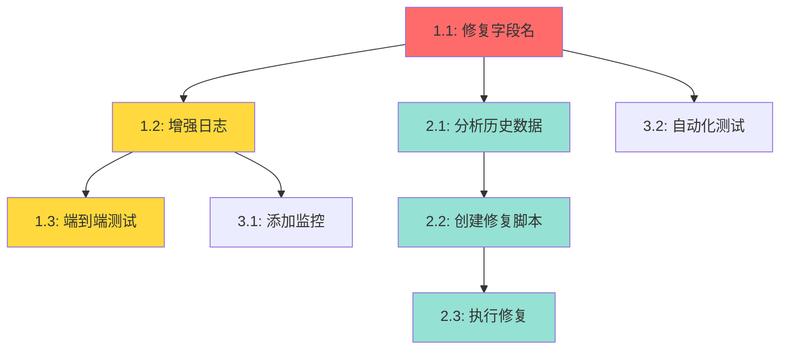

# 修复任务状态更新到数据库 - 任务清单

## 概述
修复`web/supabase_manager.py`中使用错误字段名导致的数据库更新失败问题。

## 任务列表

### 阶段1: 核心修复 (紧急)

#### 任务1.1: 修复数据库查询字段名
**优先级**: 🔴 紧急
**预估时间**: 5分钟
**负责模块**: `web/supabase_manager.py`

- [x] 将第297行的`eq('global_task_id', global_task_id)`改为`eq('task_id', task_id)`
- [x] 检查同文件中是否有其他使用`global_task_id`的地方需要修复
- [x] 更新函数参数名从`global_task_id`改为`task_id`(可选,保持API一致性)

**验证标准**:
- 代码修改后能正常启动应用
- 数据库WHERE条件能正确匹配到记录
- 更新操作返回成功(result.data不为空)

**依赖**: 无

**代码位置**: `web/supabase_manager.py:297`

**修改前**:
```python
result = self.supabase.table('tasks').update(update_data).eq('global_task_id', global_task_id).execute()
```

**修改后**:
```python
result = self.supabase.table('tasks').update(update_data).eq('task_id', task_id).execute()
```

---

#### 任务1.2: 增强更新失败日志
**优先级**: 🟡 高
**预估时间**: 5分钟
**负责模块**: `web/supabase_manager.py`

- [x] 在`update_task()`方法中添加调试日志记录更新结果
- [x] 当`result.data`为空时记录WARNING级别日志
- [x] 记录受影响的行数

**验证标准**:
- 成功更新时日志显示"Task updated successfully: {task_id}, affected rows: 1"
- 更新失败时日志显示"Task update returned no data for task_id: {task_id}"
- 日志包含足够上下文信息便于调试

**依赖**: 任务1.1

**代码位置**: `web/supabase_manager.py:271-308`

**实现示例**:
```python
def update_task(self, task_id: str, **kwargs) -> bool:
    # ... existing code ...

    result = self.supabase.table('tasks').update(update_data).eq('task_id', task_id).execute()

    if result.data:
        logger.debug(f"Task updated successfully: {task_id}, affected rows: {len(result.data)}")
        return True
    else:
        logger.warning(f"Task update returned no data for task_id: {task_id}")
        return False
```

---

#### 任务1.3: 端到端验证测试
**优先级**: 🟡 高
**预估时间**: 10分钟
**负责模块**: 手动测试

- [x] 启动Web服务
- [x] 创建新任务并执行到完成
- [x] 刷新页面,验证任务状态仍为"completed"
- [x] 检查数据库中的status字段已更新
- [x] 测试失败任务的状态更新

**验证标准**:
- 任务完成后数据库status字段为'completed'
- 任务失败后数据库status字段为'error'
- 停止任务后数据库status字段为'stopped'
- 刷新页面后状态保持不变
- 应用重启后状态仍然正确

**依赖**: 任务1.1, 1.2

**验证SQL**:
```sql
-- 检查最新任务的状态
SELECT task_id, status, end_time, last_activity
FROM tasks
ORDER BY created_at DESC
LIMIT 5;
```

---

### 阶段2: 历史数据修复 (中优先级)

#### 任务2.1: 分析历史数据状态
**优先级**: 🟢 中
**预估时间**: 15分钟
**负责模块**: 数据分析

- [ ] 查询数据库中所有status='running'的任务
- [ ] 识别哪些任务的last_activity超过1小时(很可能已完成)
- [ ] 检查是否有error_message或result字段(判断实际状态)
- [ ] 统计需要修复的任务数量

**验证标准**:
- 生成需要修复的任务列表
- 确定每个任务的正确状态(completed/error/stopped)

**依赖**: 任务1.1

**分析SQL**:
```sql
-- 查找可能已完成但状态仍为running的任务
SELECT task_id, status, created_at, last_activity,
       EXTRACT(EPOCH FROM (NOW() - last_activity))/3600 as hours_since_activity
FROM tasks
WHERE status = 'running'
  AND last_activity < NOW() - INTERVAL '1 hour'
ORDER BY last_activity DESC;
```

---

#### 任务2.2: 创建数据修复脚本
**优先级**: 🟢 中
**预估时间**: 20分钟
**负责模块**: 新建`scripts/fix_historical_task_status.py`

- [ ] 创建Python脚本读取需要修复的任务
- [ ] 根据last_activity时间和error_message判断正确状态
- [ ] 批量更新数据库
- [ ] 生成修复报告

**验证标准**:
- 脚本能正确识别任务的实际状态
- 安全地更新数据库(使用事务)
- 生成详细的修复日志
- 提供--dry-run选项预览修复

**依赖**: 任务2.1

**脚本框架**:
```python
#!/usr/bin/env python3
"""
Fix historical task status in database.

Usage:
    python scripts/fix_historical_task_status.py --dry-run  # Preview
    python scripts/fix_historical_task_status.py            # Execute
"""

import sys
from pathlib import Path
sys.path.insert(0, str(Path(__file__).parent.parent))

from web.supabase_manager import SupabaseTaskManager
from datetime import datetime, timedelta

def main(dry_run=False):
    manager = SupabaseTaskManager()

    # Find stale running tasks
    cutoff_time = datetime.now() - timedelta(hours=1)
    stale_tasks = manager.supabase.table('tasks')\
        .select('*')\
        .eq('status', 'running')\
        .lt('last_activity', cutoff_time.isoformat())\
        .execute()

    print(f"Found {len(stale_tasks.data)} stale tasks")

    for task_data in stale_tasks.data:
        task_id = task_data['task_id']
        # Determine correct status based on error_message, result, etc.
        new_status = determine_status(task_data)

        print(f"Task {task_id}: running -> {new_status}")

        if not dry_run:
            manager.update_task_status(task_id, new_status)

    print(f"{'[DRY RUN] ' if dry_run else ''}Updated {len(stale_tasks.data)} tasks")

def determine_status(task_data):
    """Determine correct status for a stale task"""
    if task_data.get('error_message'):
        return 'error'
    elif task_data.get('result'):
        return 'completed'
    else:
        return 'stopped'  # Unknown, mark as stopped

if __name__ == '__main__':
    import argparse
    parser = argparse.ArgumentParser()
    parser.add_argument('--dry-run', action='store_true')
    args = parser.parse_args()
    main(dry_run=args.dry_run)
```

---

#### 任务2.3: 执行历史数据修复
**优先级**: 🟢 中
**预估时间**: 5分钟
**负责模块**: 脚本执行

- [ ] 先执行--dry-run预览修复
- [ ] 确认修复计划合理
- [ ] 执行实际修复
- [ ] 验证数据库状态

**验证标准**:
- 所有历史任务状态正确更新
- 无数据丢失或损坏
- 修复日志清晰完整

**依赖**: 任务2.2

---

### 阶段3: 监控和预防 (低优先级)

#### 任务3.1: 添加数据库更新监控
**优先级**: ⚪ 低
**预估时间**: 30分钟
**负责模块**: `web/supabase_manager.py`

- [ ] 添加Prometheus指标或日志统计
- [ ] 记录更新成功/失败次数
- [ ] 记录更新延迟
- [ ] 添加告警规则(更新失败率>10%)

**验证标准**:
- 能实时监控数据库更新健康度
- 异常情况及时告警
- 指标数据可导出分析

**依赖**: 任务1.2

---

#### 任务3.2: 添加自动化测试
**优先级**: ⚪ 低
**预估时间**: 30分钟
**负责模块**: `tests/test_task_persistence.py`

- [ ] 创建单元测试验证update_task()
- [ ] 测试正常更新场景
- [ ] 测试错误处理场景
- [ ] 集成测试验证端到端流程

**验证标准**:
- 测试覆盖率>80%
- 所有测试通过
- 能捕获字段名错误等问题

**依赖**: 任务1.1

**测试示例**:
```python
def test_task_status_update():
    manager = SupabaseTaskManager()

    # Create task
    task = manager.create_task(
        task_description="测试任务",
        device_id="test-device"
    )
    assert task.status == 'running'

    # Update status
    success = manager.update_task_status(task.task_id, 'completed')
    assert success == True

    # Verify memory
    updated_task = manager.get_task(task.task_id)
    assert updated_task.status == 'completed'

    # Verify database
    db_result = manager.supabase.table('tasks')\
        .select('status')\
        .eq('task_id', task.task_id)\
        .execute()
    assert len(db_result.data) == 1
    assert db_result.data[0]['status'] == 'completed'
```

---

## 任务依赖关系图



## 里程碑

### M1: 核心问题修复 (关键路径)
- **完成时间**: Day 1 (20分钟)
- **包含任务**: 1.1, 1.2, 1.3
- **交付物**: 数据库更新正常工作,新任务状态正确持久化

### M2: 历史数据修复
- **完成时间**: Day 1-2 (40分钟)
- **包含任务**: 2.1, 2.2, 2.3
- **交付物**: 所有历史任务状态正确

### M3: 长期改进 (可选)
- **完成时间**: Day 2-3 (1小时)
- **包含任务**: 3.1, 3.2
- **交付物**: 完善的监控和测试

## 风险评估

### 高风险
- **历史数据修复错误**: 批量更新可能误判任务状态
  - 缓解措施: 使用--dry-run预览,小批量测试

### 中风险
- **API兼容性**: 修改参数名可能影响调用方
  - 缓解措施: 保持`global_task_id`作为别名(可选)

### 低风险
- **性能下降**: 增加日志可能影响性能
  - 缓解措施: 使用DEBUG级别,生产环境可关闭

## 验收标准

1. ✅ 新创建的任务完成后,数据库status字段正确更新
2. ✅ 刷新页面后,任务状态保持不变
3. ✅ 应用重启后,任务状态仍然正确
4. ✅ 历史任务状态已修复(running -> completed/error/stopped)
5. ✅ 更新失败时有清晰的日志记录
6. ✅ 通过端到端测试验证

## 工作量估算

| 阶段 | 任务数 | 预估时间 | 优先级分布 |
|------|-------|---------|-----------|
| 阶段1 | 3 | 20分钟 | 紧急/高 |
| 阶段2 | 3 | 40分钟 | 中 |
| 阶段3 | 2 | 1小时 | 低 |
| **总计** | **8** | **2小时** | - |

## 建议执行顺序

**最小可行修复路径** (MVP):
1. 任务1.1 → 1.2 → 1.3 (核心修复) - 20分钟
2. **总计**: 20分钟即可解决当前问题

**完整修复路径**:
1. 阶段1全部 (20分钟)
2. 阶段2全部 (40分钟) - 修复历史数据
3. **总计**: 1小时

**生产就绪路径**:
1. 阶段1 (20分钟)
2. 阶段2 (40分钟)
3. 阶段3 (1小时)
4. **总计**: 2小时
