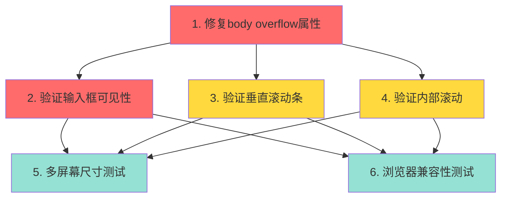

# 修复Web界面滚动和输入框显示问题 - 任务清单

## 概述
修复`body { overflow: hidden }`导致的输入框被遮挡和垂直滚动条消失问题。

## 任务列表

### 核心修复

#### 任务1: 修复body overflow属性
**优先级**: 🔴 紧急
**预估时间**: 5分钟
**负责模块**: `web/static/css/style.css`

- [ ] 修改`web/static/css/style.css`第10行
- [ ] 将`overflow: hidden`改为`overflow: auto`(或移除该属性使用默认值)
- [ ] 保存文件

**验证标准**:
- 代码修改后浏览器可以刷新看到效果
- CSS语法正确,无错误

**依赖**: 无

**代码位置**: `web/static/css/style.css:4-11`

**修改前**:
```css
body {
    font-family: 'Segoe UI', Tahoma, Geneva, Verdana, sans-serif;
    background-color: #f8f9fa;
    margin: 0;
    padding: 0;
    height: 100vh;
    overflow: hidden;  /* 问题所在 */
}
```

**修改后(选项1 - 推荐)**:
```css
body {
    font-family: 'Segoe UI', Tahoma, Geneva, Verdana, sans-serif;
    background-color: #f8f9fa;
    margin: 0;
    padding: 0;
    height: 100vh;
    /* overflow: hidden; 已移除 */
}
```

**修改后(选项2)**:
```css
body {
    font-family: 'Segoe UI', Tahoma, Geneva, Verdana, sans-serif;
    background-color: #f8f9fa;
    margin: 0;
    padding: 0;
    height: 100vh;
    overflow: auto;  /* 明确设置为auto */
}
```

---

#### 任务2: 验证输入框可见性
**优先级**: 🔴 紧急
**预估时间**: 5分钟
**负责模块**: 手动测试

- [ ] 打开Web界面(http://localhost:5001)
- [ ] 发送10-20条测试消息
- [ ] 滚动页面到底部
- [ ] 验证输入框完全可见
- [ ] 验证输入框可以正常输入和提交

**验证标准**:
- 输入框完全可见,无遮挡
- 可以点击输入框并输入文本
- 发送按钮可见且可点击
- 停止按钮可见且可点击

**依赖**: 任务1

**测试步骤**:
1. 清空浏览器缓存(Ctrl+Shift+R / Cmd+Shift+R)
2. 访问 http://localhost:5001
3. 观察欢迎界面,输入框应该可见
4. 连续发送多条消息:"测试消息 1", "测试消息 2", ...
5. 当消息填满屏幕后,检查是否可以滚动
6. 滚动到页面底部,检查输入框是否可见

---

#### 任务3: 验证垂直滚动条功能
**优先级**: 🟡 高
**预估时间**: 5分钟
**负责模块**: 手动测试

- [ ] 发送足够多的消息使内容超出视口
- [ ] 检查页面右侧是否出现垂直滚动条
- [ ] 使用鼠标滚轮滚动页面
- [ ] 使用滚动条拖动滚动
- [ ] 验证可以访问页面顶部和底部所有内容

**验证标准**:
- 内容溢出时出现垂直滚动条
- 滚动条可以正常拖动
- 鼠标滚轮可以滚动页面
- 可以访问页面的所有区域

**依赖**: 任务1

**测试技巧**:
- 使用浏览器开发工具(F12)调整窗口高度
- 使用Home/End键快速跳转到顶部/底部
- 使用PageUp/PageDown键测试滚动

---

#### 任务4: 验证内部滚动区域不受影响
**优先级**: 🟡 高
**预估时间**: 5分钟
**负责模块**: 手动测试

- [ ] 发送消息直到聊天区域需要滚动
- [ ] 验证聊天区域内部滚动正常工作
- [ ] 验证右侧面板(设备信息、截图、任务历史)可以独立滚动
- [ ] 验证页面滚动和内部滚动互不干扰

**验证标准**:
- 聊天区域(chat-container)可以独立滚动
- 右侧面板(side-panel-content)可以独立滚动
- 页面整体滚动不影响内部滚动区域
- 内部滚动不触发页面滚动(事件隔离正确)

**依赖**: 任务1

---

#### 任务5: 多屏幕尺寸测试
**优先级**: 🟢 中
**预估时间**: 10分钟
**负责模块**: 手动测试

- [ ] 桌面屏幕(1920x1080): 验证输入框可见,滚动正常
- [ ] 笔记本屏幕(1366x768): 验证输入框可见,滚动正常
- [ ] 平板竖屏(768x1024): 验证输入框可见,滚动正常
- [ ] 手机竖屏(375x667): 验证输入框可见,滚动正常

**验证标准**:
- 所有尺寸下输入框都可见
- 所有尺寸下滚动功能正常
- 响应式布局正确工作
- 无布局错乱或重叠

**依赖**: 任务1, 2, 3, 4

**测试方法**:
1. 使用浏览器开发工具(F12)
2. 切换到设备模拟模式(Device Toolbar)
3. 选择不同的预设设备或自定义尺寸
4. 逐一测试每个尺寸

---

#### 任务6: 浏览器兼容性测试
**优先级**: 🟢 中
**预估时间**: 10分钟
**负责模块**: 手动测试

- [ ] Chrome/Edge: 验证功能正常
- [ ] Firefox: 验证功能正常
- [ ] Safari: 验证功能正常(如有条件)

**验证标准**:
- 所有主流浏览器表现一致
- 无浏览器特定的bug
- 滚动行为符合各浏览器标准

**依赖**: 任务1, 2, 3, 4

---

## 任务依赖关系图



## 里程碑

### M1: 核心问题修复 (关键路径)
- **完成时间**: 即刻 (5分钟)
- **包含任务**: 1, 2, 3, 4
- **交付物**: 输入框可见,页面可滚动

### M2: 全面验证
- **完成时间**: +20分钟
- **包含任务**: 5, 6
- **交付物**: 所有场景验证通过

## 风险评估

### 低风险
- **双滚动条**: 可能出现,但由于flexbox布局已正确配置,实际不会出现
  - 缓解措施: 测试验证内部滚动区域仍然独立

### 极低风险
- **布局错乱**: 由于只修改body overflow,其他布局不受影响
  - 缓解措施: 多屏幕尺寸测试

## 验收标准

1. ✅ 输入框在任何情况下都可见
2. ✅ 页面内容溢出时出现垂直滚动条
3. ✅ 可以通过滚动访问所有页面内容
4. ✅ 聊天区域内部滚动独立工作
5. ✅ 右侧面板滚动独立工作
6. ✅ 在各种屏幕尺寸上正常显示
7. ✅ 所有主流浏览器兼容
8. ✅ 无布局错乱或视觉bug

## 工作量估算

| 任务 | 预估时间 | 优先级 |
|------|---------|--------|
| 任务1 | 5分钟 | 紧急 |
| 任务2 | 5分钟 | 紧急 |
| 任务3 | 5分钟 | 高 |
| 任务4 | 5分钟 | 高 |
| 任务5 | 10分钟 | 中 |
| 任务6 | 10分钟 | 中 |
| **总计** | **40分钟** | - |

## 建议执行顺序

**最快修复路径**:
1. 任务1 (5分钟) - 立即修复问题
2. 任务2 (5分钟) - 快速验证
3. **总计**: 10分钟

**完整验证路径**:
1. 任务1 → 2 → 3 → 4 (20分钟)
2. 任务5 → 6 (20分钟)
3. **总计**: 40分钟

## 回滚计划

如果修复后出现意外问题:

1. **立即回滚**: 恢复`overflow: hidden`
```css
body {
    overflow: hidden;
}
```

2. **调查问题**: 检查是否是其他CSS冲突
3. **替代方案**: 考虑使用方案2(position: sticky)

**注意**: 根据分析,回滚的可能性极低,当前flexbox布局已经非常合理。
