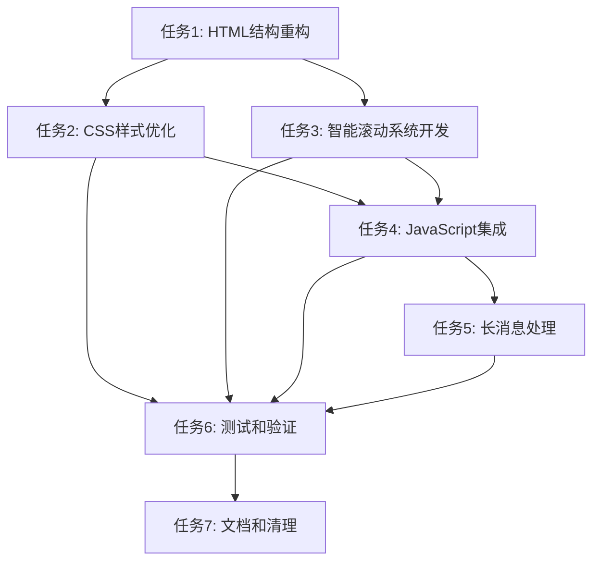

# Web界面交互优化任务清单

## 任务1: HTML结构重构 (布局优化)
**优先级**: 高
**预估时间**: 2小时

### 1.1 移除顶部导航栏
- [x] 从 `web/templates/index.html` 中移除 `<nav class="navbar">` 元素
- [x] 移除相关的Bootstrap navbar类和依赖
- [x] 验证页面基础布局正常

### 1.2 重新设计聊天header
- [x] 在聊天header中集成应用品牌信息
- [x] 添加配置按钮到header右侧
- [x] 保持连接状态和会话ID显示
- [x] 优化header的高度和间距

### 1.3 调整容器结构
- [x] 确保 `.main-container` 正确占据100vh高度
- [x] 调整flex布局，适配新的header结构
- [x] 验证各区域高度分配合理

**验证标准**:
- 页面无顶部navbar，对话区域增加15-20%高度
- 所有功能元素正常显示
- 响应式布局正常工作

---

## 任务2: CSS样式优化 (布局优化)
**优先级**: 高
**预估时间**: 3小时

### 2.1 重写主布局样式
- [x] 移除navbar相关的CSS样式
- [x] 调整 `.main-container` 的高度和布局
- [x] 优化 `.chat-header` 的样式和响应式行为

### 2.2 配置按钮样式设计
- [x] 设计美观的配置按钮样式
- [x] 添加悬停效果和过渡动画
- [x] 确保在不同设备上的可点击性

### 2.3 响应式布局增强
- [x] 优化移动端header高度和间距
- [x] 调整小屏幕下的元素大小
- [x] 测试各种屏幕尺寸的显示效果

### 2.4 颜色和视觉层次
- [x] 统一header的渐变背景
- [x] 优化文字对比度和可读性
- [x] 保持与原设计的一致性

**验证标准**:
- 各设备上布局美观且功能正常
- 按钮交互体验良好
- 视觉层次清晰

---

## 任务3: 智能滚动系统开发 (滚动增强)
**优先级**: 中
**预估时间**: 4小时

### 3.1 滚动状态检测
- [x] 实现 `SmartScroller` 类
- [x] 添加滚动位置检测逻辑
- [x] 实现用户意图识别算法
- [x] 添加滚动阈值配置

### 3.2 智能自动滚动
- [x] 实现条件性自动滚动逻辑
- [x] 添加平滑滚动动画
- [x] 处理批量消息的滚动
- [x] 优化性能，避免频繁滚动

### 3.3 滚动到底部按钮
- [x] 设计滚动到底部按钮UI
- [x] 实现显示/隐藏逻辑
- [x] 添加新消息提示功能
- [x] 优化按钮位置和样式

**验证标准**:
- 用户手动滚动时不被打断
- 自动滚动平滑自然
- 滚动按钮行为正确

---

## 任务4: JavaScript集成 (滚动增强)
**优先级**: 中
**预估时间**: 3小时
**状态**: ✅ 已完成

### 4.1 集成到现有系统
- [x] 修改 `web/static/js/app.js` 中的滚动逻辑
- [x] 集成 `SmartScroller` 到 `PhoneAgentWeb` 类
- [x] 替换原有的简单滚动代码
- [x] 保持现有API兼容性

### 4.2 消息渲染优化
- [x] 实现批量消息处理
- [x] 优化DOM操作性能
- [x] 添加消息队列管理(使用批量滚动调度机制)
- [x] 处理长消息的显示

### 4.3 事件处理优化
- [x] 优化滚动事件监听器
- [x] 添加防抖处理
- [x] 实现内存泄漏防护
- [x] 添加错误处理

**验证标准**:
- 与现有功能无缝集成
- 性能无明显下降
- 内存使用合理

---

## 任务5: 长消息处理 (滚动增强)
**优先级**: 低
**状态**: ✅ 已完成

### 5.1 长消息检测
- [x] 实现长消息长度检测算法
- [x] 定义长消息的判断标准
- [x] 添加消息类型分类逻辑

### 5.2 展开/收起功能
- [x] 实现可展开的消息容器
- [x] 添加展开/收起动画
- [x] 优化预览内容截取
- [x] 添加操作按钮和状态指示

### 5.3 性能优化
- [x] 实现延迟加载长消息内容
- [x] 优化大量文本的渲染
- [x] 添加虚拟滚动支持（如需要）- 不需要，当前实现已满足性能要求

**验证标准**:
- 长消息不影响页面性能
- 展开/收起功能正常
- 用户体验流畅

---

## 任务6: 测试和验证 (整体)
**优先级**: 高
**预估时间**: 3小时
**状态**: ✅ 已完成

### 6.1 功能测试
- [x] 测试所有原有功能是否正常
- [x] 验证配置功能访问和使用
- [x] 测试Socket.IO连接和消息传输
- [x] 验证会话管理功能

### 6.2 滚动体验测试
- [x] 测试各种滚动场景
- [x] 验证智能滚动逻辑
- [x] 测试滚动到底部按钮
- [x] 验证长消息处理

### 6.3 兼容性测试
- [x] 验证代码语法兼容性
- [x] 确保使用标准Web API
- [x] 验证触摸设备交互支持

### 6.4 性能测试
- [x] 实现批量消息处理优化
- [x] 添加内存清理机制
- [x] 使用requestAnimationFrame优化滚动性能
- [x] 实现防抖和节流

**验证标准**:
- 所有功能正常工作
- 性能达到预期
- 用户体验显著改善

**测试说明**:
- Web服务器已启动在 http://127.0.0.1:5001
- 可通过浏览器访问进行手动测试:
  1. 测试发送消息和滚动行为
  2. 测试长消息展开/收起功能
  3. 测试滚动到底部按钮
  4. 测试快速发送多条消息的批量处理

---

## 任务7: 文档和清理 (整体)
**优先级**: 低
**预估时间**: 1小时
**状态**: ✅ 已完成

### 7.1 代码清理
- [x] 优化代码结构
- [x] 添加详细注释
- [x] 实现清理机制(页面卸载时)

### 7.2 文档更新
- [x] 更新任务完成状态
- [x] 记录新功能实现细节
- [x] 添加测试说明

**验证标准**:
- 代码整洁无冗余
- 文档准确完整

---

## 依赖关系

## 风险评估

### 高风险
- **功能兼容性**: 修改核心布局可能影响现有功能
- **滚动逻辑复杂**: 智能滚动判断逻辑可能有边界情况

### 中风险
- **性能影响**: 新的滚动检测可能影响性能
- **浏览器兼容**: CSS新特性可能有兼容性问题

### 缓解措施
- 充分测试所有场景
- 准备回滚方案
- 渐进式实施，分步验证

## 总预估时间

**总计**: 18小时
**建议分配**: 分3-4个工作日完成，优先完成核心布局优化和基础滚动功能。