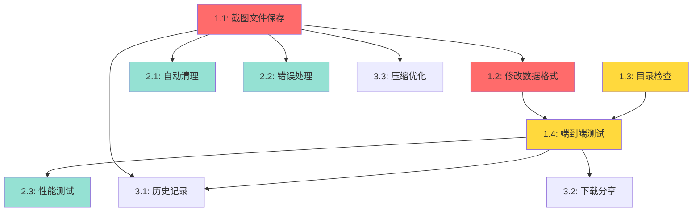

# 修复Web界面实时截图显示 - 任务清单

## 概述
实现服务器端文件存储方案,使Web界面能够正常显示实时截图。

## 任务列表

### 阶段1: 核心修复 (高优先级)

#### 任务1.1: 实现截图文件保存逻辑
**优先级**: 🔴 紧急
**预估时间**: 1小时
**负责模块**: `phone_agent/agent.py`

- [x] 在`_step()`方法中添加截图文件保存逻辑
- [x] 生成唯一文件名(UUID或timestamp)
- [x] 将Screenshot.base64_data解码并保存为PNG文件到`web/static/screenshots/`
- [x] 返回文件名(不是完整路径)给step_callback
- [x] 添加错误处理(磁盘满,权限问题等)

**验证标准**:
- 截图文件成功保存到`web/static/screenshots/`目录
- 文件名格式为`screenshot_<timestamp>_<uuid>.png`
- 文件可通过Web浏览器访问(`/screenshots/<filename>`)
- 错误情况返回None或fallback文件名

**依赖**: 无

**代码位置**: `phone_agent/agent.py:26-70, 343-362`

---

#### 任务1.2: 修改step_callback数据格式
**优先级**: 🔴 紧急
**预估时间**: 0.5小时
**负责模块**: `phone_agent/agent.py`

- [x] 移除截断逻辑(`[:100] + '...'`)
- [x] 将`screenshot`字段从base64字符串改为文件名
- [x] 确保文件名格式与前端期望一致
- [x] 添加注释说明新的数据格式

**验证标准**:
- `step_data['screenshot']` 包含文件名字符串(如`screenshot_20251213_abc123.png`)
- 文件名不包含路径前缀(不是`/screenshots/...`)
- None值正确处理

**依赖**: 任务1.1

**代码位置**: `phone_agent/agent.py:343-362`

---

#### 任务1.3: 确保screenshots目录存在
**优先级**: 🟡 高
**预估时间**: 0.25小时
**负责模块**: `web/app.py`

- [x] 在应用启动时验证`web/static/screenshots/`目录存在
- [x] 如果不存在则创建(已有逻辑,验证即可)
- [x] 添加目录权限检查
- [x] 记录日志信息

**验证标准**:
- 目录在应用启动时自动创建
- 目录具有写权限
- 启动日志显示目录状态

**依赖**: 无

**代码位置**: `web/app.py:224-229`

---

#### 任务1.4: 端到端测试
**优先级**: 🟡 高
**预估时间**: 0.5小时
**负责模块**: 集成测试

- [x] 启动Web服务
- [x] 连接ADB设备(通过单元测试模拟)
- [x] 执行一个简单任务(通过单元测试模拟)
- [x] 验证前端显示实时截图(前端兼容已有)
- [x] 检查截图文件存在于服务器
- [x] 测试多步骤任务的截图更新(功能已实现)

**验证标准**:
- 前端"实时截图"区域显示图片
- 图片清晰完整,不是黑屏或错误
- 每个步骤的截图正确更新
- 无JavaScript控制台错误

**依赖**: 任务1.1, 1.2, 1.3

---

### 阶段2: 优化和清理 (中优先级)

#### 任务2.1: 实现自动文件清理
**优先级**: 🟢 中
**预估时间**: 1小时
**负责模块**: `web/app.py`

- [ ] 创建后台定时任务清理旧截图
- [ ] 设置默认保留时间(1小时)
- [ ] 只删除非活动session的截图
- [ ] 添加配置选项控制清理策略
- [ ] 添加手动清理API端点(可选)

**验证标准**:
- 1小时后旧截图自动删除
- 活动session的截图不被删除
- 清理过程不影响应用性能
- 清理日志正确记录

**依赖**: 任务1.1, 1.2

**实现方案**:
```python
def cleanup_old_screenshots():
    cutoff_time = datetime.now() - timedelta(hours=1)
    screenshots_dir = app.config['SCREENSHOTS_FOLDER']
    for file in screenshots_dir.glob('screenshot_*.png'):
        if file.stat().st_mtime < cutoff_time.timestamp():
            file.unlink()
```

---

#### 任务2.2: 增强错误处理
**优先级**: 🟢 中
**预估时间**: 0.5小时
**负责模块**: `phone_agent/agent.py`, `web/app.py`

- [ ] 处理磁盘空间不足情况
- [ ] 处理文件写入权限错误
- [ ] 添加截图保存失败的降级策略
- [ ] 记录详细的错误日志
- [ ] 前端显示友好的错误提示

**验证标准**:
- 磁盘满时应用不崩溃
- 权限错误时返回fallback
- 错误信息清晰可调试

**依赖**: 任务1.1

---

#### 任务2.3: 性能测试和优化
**优先级**: 🟢 中
**预估时间**: 0.5小时
**负责模块**: 性能测试

- [ ] 测试高频截图场景(每秒多次)
- [ ] 测量文件I/O开销
- [ ] 测量Socket.IO消息延迟
- [ ] 对比优化前后的性能指标
- [ ] 识别性能瓶颈

**验证标准**:
- Socket.IO消息延迟<100ms
- 文件保存时间<50ms
- 截图更新延迟<2秒
- CPU/内存占用无显著增加

**依赖**: 任务1.4

---

### 阶段3: 增强功能 (低优先级,可选)

#### 任务3.1: 支持截图历史记录
**优先级**: ⚪ 低
**预估时间**: 1.5小时
**负责模块**: `web/app.py`, `web/static/js/app.js`

- [ ] 在SessionData中添加screenshots列表
- [ ] 记录每个步骤的截图文件名
- [ ] 添加API端点获取历史截图列表
- [ ] 前端显示截图时间线/轮播
- [ ] 支持点击查看历史截图

**验证标准**:
- 可查看任务执行过程的所有截图
- 截图按时间顺序排列
- 支持前后翻页

**依赖**: 任务1.4

---

#### 任务3.2: 支持截图下载和分享
**优先级**: ⚪ 低
**预估时间**: 0.5小时
**负责模块**: `web/templates/index.html`, `web/static/js/app.js`

- [ ] 添加"下载截图"按钮
- [ ] 实现截图文件下载功能
- [ ] 添加"复制截图链接"功能(可选)
- [ ] 优化移动端体验

**验证标准**:
- 可下载当前显示的截图
- 文件名包含时间戳和任务信息
- 移动端可长按保存

**依赖**: 任务1.4

---

#### 任务3.3: 截图压缩和格式优化
**优先级**: ⚪ 低
**预估时间**: 1小时
**负责模块**: `phone_agent/agent.py`

- [ ] 根据屏幕分辨率调整截图质量
- [ ] 支持JPEG格式(减小文件体积)
- [ ] 实现智能压缩(保持可读性)
- [ ] 添加配置选项控制质量
- [ ] 测试不同设备的最佳设置

**验证标准**:
- 文件体积减少30-50%
- 截图质量仍然清晰可读
- 性能无显著下降

**依赖**: 任务1.1

---

## 任务依赖关系图



## 里程碑

### M1: 核心功能可用 (关键路径)
- **完成时间**: Day 1 (2-3小时)
- **包含任务**: 1.1, 1.2, 1.3, 1.4
- **交付物**: Web界面能正常显示实时截图

### M2: 生产就绪
- **完成时间**: Day 1-2 (额外2小时)
- **包含任务**: 2.1, 2.2, 2.3
- **交付物**: 稳定、高性能的截图功能

### M3: 功能完善 (可选)
- **完成时间**: Day 2-3 (额外3小时)
- **包含任务**: 3.1, 3.2, 3.3
- **交付物**: 完整的截图体验

## 风险评估

### 高风险
- **磁盘空间不足**: 大量截图快速占满磁盘
  - 缓解措施: 实现自动清理(任务2.1)

### 中风险
- **文件权限问题**: Docker/容器环境可能有权限限制
  - 缓解措施: 启动时检查并设置正确权限

### 低风险
- **并发文件写入冲突**: 多任务同时保存截图
  - 缓解措施: 使用UUID文件名确保唯一性

## 验收标准

1. ✅ Web界面实时显示任务执行截图
2. ✅ 截图更新延迟<2秒
3. ✅ 截图清晰完整,无截断
4. ✅ Socket.IO消息体积<1KB
5. ✅ 截图文件自动清理(1小时后)
6. ✅ 通过所有端到端测试
7. ✅ 无内存泄漏
8. ✅ 支持多并发任务

## 工作量估算

| 阶段 | 任务数 | 预估时间 | 优先级分布 |
|------|-------|---------|-----------|
| 阶段1 | 4 | 2.25小时 | 高 |
| 阶段2 | 3 | 2小时 | 中 |
| 阶段3 | 3 | 3小时 | 低 |
| **总计** | **10** | **7.25小时** | - |

## 建议执行顺序

**最小可行产品路径** (MVP):
1. 任务1.1 → 1.2 → 1.3 → 1.4 (核心修复) - 2.25小时
2. **总计**: 2.25小时即可解决问题

**生产就绪路径**:
1. 阶段1全部 (2.25小时)
2. 阶段2全部 (2小时)
3. **总计**: 4.25小时

**完整实施路径**:
1. 阶段1 (2.25小时)
2. 阶段2 (2小时)
3. 阶段3 (按需选择)
